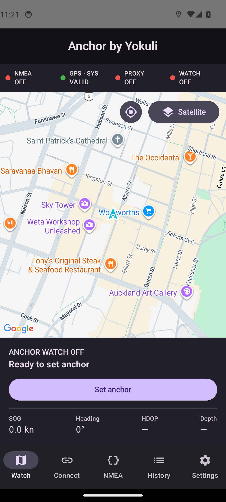
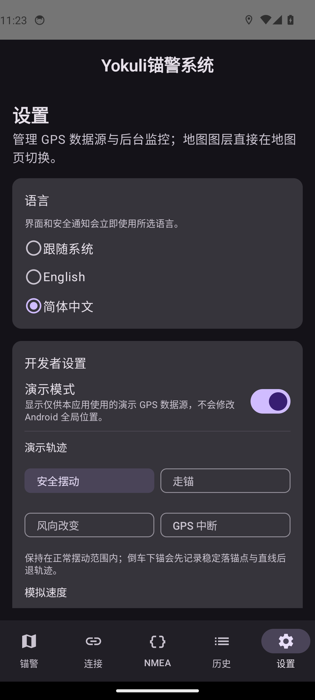

# Anchor by Yokuli

<p align="center">
  
</p>

**中文产品名：Yokuli锚警系统** · [中文说明](#中文) · [English](#english)

Android 锚警与 NMEA 0183 航行数据工具。它可以通过 TCP/UDP 接收船载 NMEA、显示实时原始数据和船舶轨迹、监测走锚与 GPS 丢失，并可在用户明确授权后把 NMEA 位置代理为 Android 全局 GPS。

Android anchor watch and NMEA 0183 navigation tool with live TCP/UDP input, raw-data diagnostics, boat track, drag/GPS-loss alarms, and an explicitly authorized NMEA-to-Android GPS proxy.

> **安全提示 / Safety:** 本应用只能作为辅助工具，不能替代正规的锚泊值守、航海判断或独立报警设备。GPS、供电、Wi-Fi、NMEA 数据源和 Android 系统都可能失效。 / This app is an auxiliary aid only. It does not replace proper watchkeeping, seamanship, or an independent alarm.

## 产品界面 / Product gallery

以下图片来自本项目实际 Debug APK 在 Android 14 模拟器上的运行画面。

| English watch | 中文语言与演示设置 |
|---|---|
|  |  |

| 中文下锚设置 | 中文活动锚警 |
|---|---|
|  |  |

---

## 中文

### 主要功能

- TCP 客户端与 UDP 监听器；连接前必须完成地址校验、端点测试并收到有效 NMEA 数据。
- 支持 RMC、GGA、GLL、VTG、ZDA、HDG、HDM、HDT、DPT、DBT，以及 GP/GN/GL/GA/BD 等 talker ID。
- 地图仅提供默认图与卫星图，可直接在地图页切换；隐藏 Google 地图工具栏、导航入口、室内与缩放按钮。
- 船形标记随真艏向或 COG 旋转，锚点单独显示；轨迹由旧到新渐变，完全淡出的点仍保留用于计算和历史记录。
- GPS 数据源可选系统 GPS、NMEA GPS，以及开发者设置中的演示 GPS。NMEA 成功连接后会自动成为默认数据源。
- 锚泊会话支持暂停、原会话继续、活动中调整范围和永久起锚；暂停不会清除中心、轨迹、范围或样本。
- 告警覆盖走锚、GPS 数据丢失、NMEA 连接丢失、定位质量和代理失败；“稍后提醒”会停止当前声音与振动，但危险持续时会再次提醒。
- 可查看最近 200 条原始 NMEA 语句、解析位置、校验错误和连接统计。
- 界面与关键后台安全通知支持跟随系统、English、简体中文，设置后立即生效。
- 像素风锚形应用图标；桌面名称固定为 **Anchor by Yokuli**。

### 快速使用

1. 首次启动时授予精确位置与通知权限。在“设置”中检查后台可靠性，并为夜间值守关闭厂商电池限制。
2. 打开“连接”，选择 TCP 客户端或 UDP 监听，填写地址和端口，再点“测试、保存并连接”。无效地址、无法访问的端点或没有有效 NMEA 数据都不会进入已连接状态。
3. 打开“NMEA”页确认原始语句和解析坐标持续更新。成功连接后，GPS 数据源默认切换为 NMEA。
4. 回到“锚警”页，直接在地图右上角选择默认图或卫星图，然后点“设置锚点”。
5. 选择下锚方式和范围：
   - **中心下锚：** GPS 天线位于锚点上方时开始，锚点与报警圈立即固定。
   - **倒车下锚：** 在落锚点开始，然后稳定倒车。橙色临时边界立即承担告警；青色圈显示锚点估算的不确定范围。样本、持续时间、位移和稳定性达到高置信度后，两圈合并为最终锚警圈。
6. 监控中可随时“调整范围”。“暂停”会保留整次会话，“继续”会在确认所选 GPS 的新鲜定位后恢复；只有“起锚”会永久关闭本次会话。
7. 如果活动锚警正在使用 NMEA，主动断开时必须选择：先安全切到新的系统 GPS 定位，或暂停锚警再断开。被动断线会保留布防、发出通知并自动重连，超过定位超时后升级为 GPS 数据丢失报警。

### 报警范围

基础模式直接填写报警半径，并可选填水深。高级模式填写低潮水深、放出的锚缆/锚链和船长，再选择严格、均衡或宽容模式。建议值以绷直后的水平锚缆长度 `sqrt(rode² - (depth + 1.5 m)²)` 为基础，再加入船长、GPS 余量，以及倒车中心学习余量。

倒车下锚的第一阶段使用开始后的稳定落锚点簇和持续后退距离确定中心，不会用一小段直线硬拟合圆；形成足够摆动弧后，才允许抗离群圆拟合做小幅修正。

### 演示 GPS

“设置 → 开发者设置 → 演示模式”开启后，GPS 数据源中才会出现演示 GPS。设置锚点前仍显示真实系统 GPS 位置；设置锚点后才运行所选轨迹。可测试安全摆动、持续走锚、风向改变和 GPS 中断，并选择 1×、2×、5× 速度。关闭演示模式会安全切回系统 GPS。

### NMEA 全局 GPS 代理

这是独立的可选功能，不是选择 NMEA GPS 的必要条件。启用步骤：

1. Android 设置 → 关于手机 → 连续点击版本号七次。
2. Android 设置 → 系统（部分设备为“更多设置”）→ 开发者选项。
3. “选择模拟位置信息应用” → **Anchor by Yokuli**。
4. 在 App 中连接有效 NMEA，选择 NMEA GPS，再打开“设置 → NMEA → Android GPS”。
5. 检查三项前置条件后开启全局代理。

代理通过 Fused Location mock mode 发布位置，并可选同步到 `GPS_PROVIDER`。系统 GPS 可能正是 App 自己注入的位置，因此代理开启时禁止把锚警切回系统 GPS，以避免数据回环；关闭代理后系统定位会恢复。第三方 App 可以拒绝模拟位置，所以无法保证兼容所有软件。

### 语言

进入“设置 → 语言”，可选择跟随系统、English 或简体中文。应用桌面名称在所有语言下始终是 **Anchor by Yokuli**；中文界面内产品标题为 **Yokuli锚警系统**。

### 本地编译

需要 JDK 17 与 Android SDK 35。在未跟踪的 `local.properties` 中配置：

```properties
sdk.dir=/path/to/Android/sdk
MAPS_API_KEY=your_android_maps_key
```

Google Cloud 密钥只需启用 **Maps SDK for Android**，并限制到包名 `com.yokuli.anchorwatch` 和签名证书 SHA 指纹。本应用不调用 Places、Routes、Geocoding、Street View 或 Map Tiles API。建议同时在 Google Cloud 设置配额与预算提醒。不要把密钥提交到 Git。

```bash
./gradlew testDebugUnitTest lintDebug assembleDebug assembleRelease
```

可直接安装的 Debug APK 位于 `app/build/outputs/apk/debug/app-debug.apk`。

### 测试与 GitHub Actions 下载

单元测试覆盖 NMEA 解析与分包、连接预检、锚警状态机、告警稍后提醒、中心估算、范围计算、演示轨迹、GPS 代理策略和语言选择。设备集成测试使用真实 TCP 流、前台服务、Room 和 Compose UI，覆盖连接、断开决策、双向 GPS 切换、倒车中心学习、暂停/继续、起锚、活动中调范围、断线恢复、GPS 丢失、演示模式和中英文切换。

`.github/workflows/android.yml` 会自动：

1. 运行单元测试与 Lint；
2. 编译 Debug APK；
3. 启动 Android 14 模拟器运行设备集成测试；
4. 每次 push 上传可安装的 Debug APK，并上传测试和 Lint 报告。

在 GitHub 仓库的 Actions 运行详情中打开 **Artifacts**，下载 `anchor-by-yokuli-debug`；其中的 `app-debug.apk` 可直接安装。报告分别位于 `anchor-by-yokuli-build-reports` 和 `anchor-by-yokuli-integration-reports`。仓库应配置名为 `MAPS_API_KEY` 的 Actions Secret。

真正的版本发布使用独立的 `.github/workflows/release.yml`，只允许在 Actions 页面手动运行。先配置以下 GitHub Actions Secrets：

- `ANDROID_SIGNING_KEY_BASE64`：发布 keystore 文件的 Base64 内容；
- `ANDROID_KEYSTORE_PASSWORD`、`ANDROID_KEY_ALIAS`、`ANDROID_KEY_PASSWORD`；
- `MAPS_API_KEY`。

然后运行 **Publish Anchor by Yokuli Release**，填写唯一的 Git tag、版本名和递增的 version code。Action 会验证签名，并创建 GitHub Release，附带已签名的 APK、可提交商店的 AAB 和 SHA-256 校验文件。签名 keystore 必须长期安全备份；丢失后无法为同一安装渠道发布可升级版本。

---

## English

### Highlights

- TCP client and UDP listener with validation and a real NMEA preflight before a connection can be saved or accepted.
- RMC, GGA, GLL, VTG, ZDA, HDG, HDM, HDT, DPT and DBT support across common talker IDs.
- Normal and satellite maps are switched on the map itself; Google toolbar, directions, indoor and zoom controls are disabled.
- A heading-aware boat marker, separate anchor marker, fading visual track, and complete retained calculation/history track.
- Selectable System, NMEA and developer-only Demo GPS sources. A verified NMEA connection becomes the selected source automatically.
- Persistent anchoring sessions with Pause, safe Resume, live range adjustment, and permanent Lift anchor actions.
- Drag, GPS-loss, NMEA-loss, quality and proxy-failure alarms. Snooze silences the current alert while monitoring continues and reminds again if danger persists.
- A live page for the latest 200 raw NMEA sentences, parsed position and diagnostics.
- Immediate in-app switching among Follow system, English and Simplified Chinese, including key background safety notifications.
- A pixel-art anchor launcher icon; the launcher label remains **Anchor by Yokuli** in every language.

### How to use

1. Grant precise-location and notification permissions. Review Background reliability in Settings and remove manufacturer battery restrictions for overnight use.
2. Open Connect, choose TCP or UDP, enter the endpoint, and tap **Test, save & connect**. Invalid endpoints and sources that provide no valid NMEA are rejected.
3. Confirm live raw sentences and parsed coordinates on the NMEA page. A verified connection automatically selects NMEA GPS.
4. Return to Watch, choose Normal or Satellite directly on the map, and tap **Set anchor**.
5. Choose the placement and range:
   - **Centre drop:** start while the GPS antenna is over the anchor. The centre and boundary arm immediately.
   - **Back down:** start at the drop point and reverse steadily. An orange temporary boundary protects the session immediately while a cyan uncertainty circle tightens around the estimated anchor. They merge after high-confidence centre resolution.
6. Adjust the radius at any time. Pause preserves the session, centre, samples, range and track; Resume waits for a fresh selected-source fix. Lift anchor permanently ends the session.
7. Disconnecting NMEA from a live NMEA-based watch requires a deliberate choice: safely acquire System GPS first, or pause and disconnect. Passive loss keeps the watch armed, warns immediately, reconnects, and escalates to GPS-data-loss if positions remain stale.

### Range and centre estimation

Basic mode accepts a direct radius and optional depth. Advanced mode combines low-tide depth, rode/chain paid out, boat length and a Strict/Balanced/Tolerant preset. It starts with taut horizontal rode `sqrt(rode² - (depth + 1.5 m)²)`, then adds boat length, GPS margin and a visible Back-down learning margin.

Back-down resolution first identifies the stable, time-ordered drop cluster and requires sustained reverse movement. It does not pretend that a short straight line uniquely defines a circle. A robust circle fit may refine the centre later, only after the swing arc has sufficient coverage and acceptable residual error.

### Demo GPS

Enable **Settings → Developer settings → Demo mode** to reveal Demo GPS. The real System GPS position remains the origin until Set anchor is pressed. The available scenarios are Safe swing, Anchor drag, Wind shift and GPS dropout at 1×, 2× or 5×. Disabling Demo performs a safe handover back to System GPS.

### Global NMEA GPS proxy

This optional feature is separate from using NMEA inside the app:

1. Enable Android Developer options.
2. Choose **Anchor by Yokuli** under Select mock location app.
3. Connect a valid NMEA source and select NMEA GPS.
4. Open Settings → NMEA → Android GPS, review the preflight rows, and enable the proxy.

The proxy uses Fused Location mock mode and can also publish to `GPS_PROVIDER`. System GPS cannot be selected for the watch while proxying because the app could consume its own injected fix; disable the proxy first. Third-party apps may reject mock locations, so universal compatibility is not possible.

### Language and app name

Choose Follow system, English or Simplified Chinese under Settings → Language. The launcher name is always **Anchor by Yokuli**; the Chinese in-app product title is **Yokuli锚警系统**.

### Build, test and download

JDK 17 and Android SDK 35 are required. Put `MAPS_API_KEY` in untracked `local.properties`, or expose it as an environment variable in CI. Restrict it to the Android package and signing SHA fingerprint, and enable only Maps SDK for Android.

```bash
./gradlew testDebugUnitTest lintDebug assembleDebug assembleRelease
./gradlew connectedDebugAndroidTest
```

GitHub Actions runs unit tests, lint, the Debug build and the Android 14 instrumented suite. Every push publishes the installable APK as the `anchor-by-yokuli-debug` artifact; reports are available as `anchor-by-yokuli-build-reports` and `anchor-by-yokuli-integration-reports`.

Production publishing is intentionally separate. Configure `ANDROID_SIGNING_KEY_BASE64`, `ANDROID_KEYSTORE_PASSWORD`, `ANDROID_KEY_ALIAS`, `ANDROID_KEY_PASSWORD`, and `MAPS_API_KEY`, then manually run **Publish Anchor by Yokuli Release** with a unique tag, version name and increasing version code. It creates a GitHub Release containing the verified signed APK, Play-ready AAB and SHA-256 checksums. Keep the release keystore backed up securely; losing it prevents future upgrades through the same distribution channel.

## Privacy and permissions

Sessions remain on the device. There is no account, analytics, telemetry or project-owned cloud backend. Network/Wi-Fi permissions are used for NMEA; location and location-foreground-service permissions are used for System GPS and proxy operation; notifications, vibration and wake locks support alarms. No contacts, camera, microphone or broad storage permission is requested.

Third-party notices are in [THIRD_PARTY_NOTICES.md](THIRD_PARTY_NOTICES.md).
