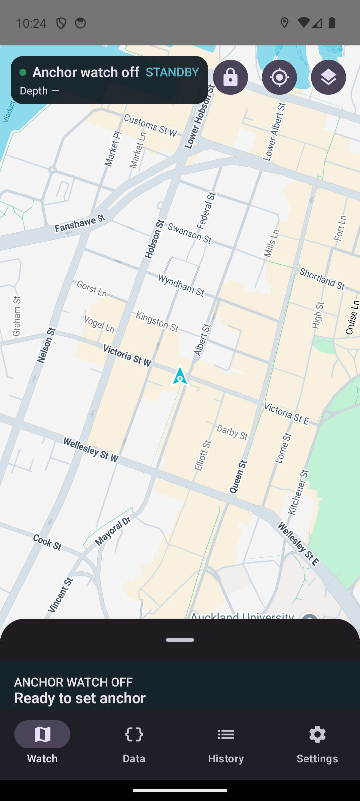
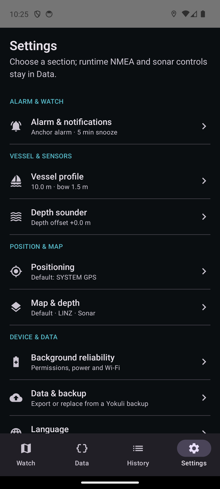
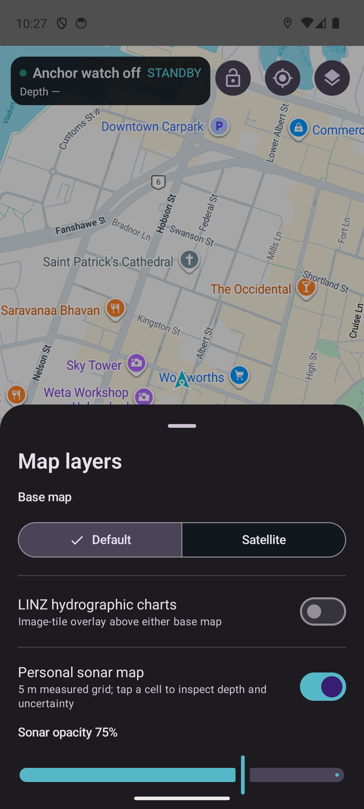
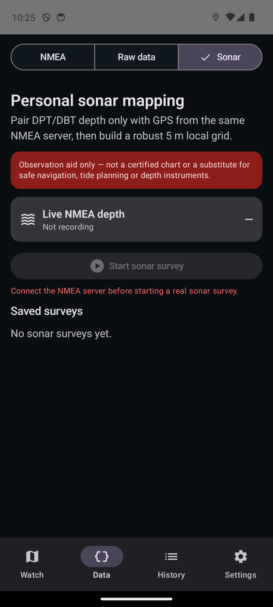
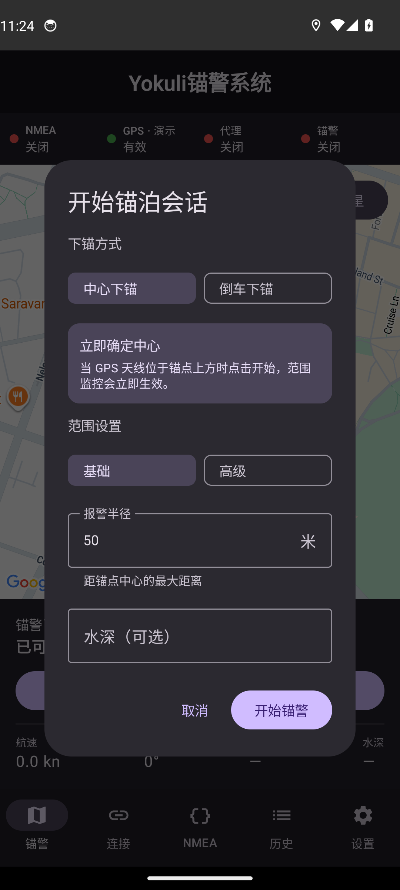
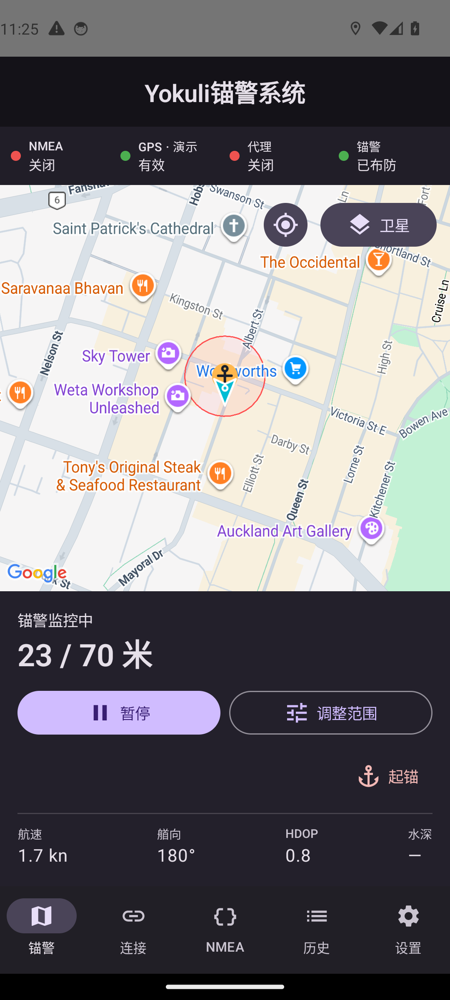

# Anchor Watch

<p align="center">
  
</p>

**中文产品名：Anchor Watch** · [中文说明](#中文) · [English](#english)

Android 锚警与 NMEA 0183 航行数据工具。它可以通过 TCP/UDP 接收船载 NMEA、显示实时原始数据和船舶轨迹、监测走锚与 GPS 丢失，并可在用户明确授权后把 NMEA 位置代理为 Android 全局 GPS。

Android anchor watch and NMEA 0183 navigation tool with live TCP/UDP input, raw-data diagnostics, boat track, drag/GPS-loss alarms, and an explicitly authorized NMEA-to-Android GPS proxy.

> **安全提示 / Safety:** 本应用只能作为辅助工具，不能替代正规的锚泊值守、航海判断或独立报警设备。GPS、供电、Wi-Fi、NMEA 数据源和 Android 系统都可能失效。 / This app is an auxiliary aid only. It does not replace proper watchkeeping, seamanship, or an independent alarm.

## Made aboard Yokuli / 诞生于 Yokuli 船上

走向大海以前，**kuku** 是一名程序员；来到新西兰以后，航海慢慢成了生活。我们的团队翻新了 **Yokuli**——一艘由新西兰游艇设计师 **Alan Wright** 设计的 **Lotus 10.6**。**yoyo 是船长**，kuku 和 lili 是船员。我们想先去看看新西兰的岛屿与海湾；如果风、时间和生活都允许，也希望有一天能驶向更远的世界。Anchor Watch 正是在这段生活里长出来的。完整的锚警、NMEA、声呐与离线地图功能永久免费，不设账号、广告、付费解锁或 supporter 权益。

Before turning his life towards the sea, **kuku** worked as a programmer. In New Zealand, our crew refitted **Yokuli**, a **Lotus 10.6** designed by New Zealand yacht designer **Alan Wright**. **Yoyo is the captain**; kuku and lili complete the crew. We hope first to explore New Zealand’s islands and bays and, if wind, time and life allow, one day sail farther into the world. Anchor Watch grew from that life aboard. The complete anchor-watch, NMEA, sonar and offline-map feature set remains free, with no account, ads, paid unlocks or supporter entitlements.

- [在 YouTube 看 Yokuli / Watch Yokuli on YouTube](https://www.youtube.com/@yokuli_ocean_diary)
- [自愿支持船员 / Voluntarily support the crew on Buy Me a Coffee](https://buymeacoffee.com/ukus3yya8a) — 支持不会解锁任何功能 / support unlocks no features.
- 功能建议与反馈 / Feature requests and feedback: `kuku.the.developer@gmail.com`

App 内这些内容只出现在首次介绍和设置区；设置首页直接提供清晰的支持入口，“关于与支持”保留完整故事。它们不会进入锚警、报警、数据或历史等安全工作流。Buy Me a Coffee 在跳转外部浏览器前会再次确认。独立 Feedback 页面只生成可编辑的 `mailto:` 草稿并交给用户选择的邮件 App；Anchor Watch 不代发、不保存、不追踪邮件。

## 产品界面 / Product gallery

以下图片来自本项目实际 Debug APK 在 Android 14 模拟器上的运行画面。

| Real Maps cold start | Refactored Settings |
|---|---|
|  |  |

| Map-local layers | Same-stream sonar gate |
|---|---|
|  |  |

| 中文下锚设置 | 中文活动锚警 |
|---|---|
|  |  |

---

## 中文

### 主要功能

- TCP 客户端与 UDP 监听器；连接前必须完成地址校验、端点测试并收到有效 NMEA 数据。
- 支持 RMC、GGA、GLL、VTG、ZDA、HDG、HDM、HDT、DPT、DBT、MWD、MWV，以及 GP/GN/GL/GA/BD 等 talker ID；TWD、TWA、TWS、AWA、AWS 分开保存，不会互相覆盖。
- 地图页提供互斥的地图、卫星与航海三种样式。航海样式使用清淡 Google 底图和 OpenSeaMap 航标；独立的 LINZ“区域水深海图”是唯一提供透明度设置的地图层。Google 地图工具栏、导航入口、室内与缩放按钮均隐藏。
- 合法离线策略：绝不缓存 Google；最近使用的 OpenSeaMap 航标与 LINZ 海图瓦片分开受限缓存，也可导入用户有权使用的 raster MBTiles。
- 船形标记随真艏向或 COG 旋转，确认前不显示锚图标；地图保留最近 24 小时的 breadcrumb，最新至少 600 米保持清晰，随后才按距离渐隐。渲染只抽稀，不删除计算点。
- 正常模式可选系统 GPS 或 NMEA GPS；只有服务器已连接并持续提供新鲜有效定位时才能选择 NMEA，成功连接后它会自动成为默认数据源。会话一旦开始（包括暂停期间）就锁定该来源直到起锚；断线不会静默切换。演示模式会单独锁定演示 GPS。
- 锚点可使用当前定位、手动十进制度坐标或地图长按选点；不知道锚点时可选自动估算。高置信度结果只作为候选显示，用户确认前绝不会移动生效中的报警圈，确认后也只移动圆心、不改半径。
- GPS 异常点先隔离；单点跳点不会进入报警或圆心学习，连续一致的真实位移会从第一个可疑点恢复进入计算。System GPS 的 bearing 始终按 COG 处理，绝不冒充船首向。
- 锚泊会话支持暂停、原会话继续、活动中调整范围和永久起锚；暂停不会清除中心、轨迹、范围或样本。
- 已结束的锚泊历史可由用户确认后删除，关联轨迹与事件时间线一并删除；活动会话不能删除。
- 告警覆盖走锚、GPS 数据丢失、NMEA 连接丢失、定位质量和代理失败；“稍后提醒”会停止当前声音与振动，但危险持续时会再次提醒。
- 可选的环境警戒随锚泊 session 运行：DPT/DBT 浅水/深水警报、真风优先且明确标注来源的风速提醒/警报，以及经过至少 2 分钟稳定学习后固定的真风向突变基线。多种危险各自持有警报，结束测试音或清除一种危险不会误停其他警报。
- 本机锚地收藏库可从已确定中心的当前/历史会话保存、编辑、删除、预览和复用设置；“使用设置”只复制范围、水深与锚链，绝不把旧坐标当成新锚点。附近提示只在 App 空闲时安静显示。
- “Set anchor”之前统一运行 Watch Preflight；GPS 新鲜度/精度、NMEA、通知、可听报警、电池优化/电量、网络、后台服务、存储与声呐状态会明确分成 OK、可继续警告和禁止布防。
- Room schema 正式导出并提交；Storage & support 页面显示数据体量、清理可重建缓存，并可导出不含 raw NMEA、API key 或精确船位的 72 小时 Incident Support Bundle。
- 可查看最近 200 条原始 NMEA 语句、解析位置、校验错误和连接统计。
- 界面与关键后台安全通知通过 🇨🇳 / 🇬🇧 两个按钮即时切换。
- 像素风锚形应用图标；桌面名称固定为 **Anchor Watch**。

### 快速使用

1. 首次启动时授予精确位置与通知权限。在“设置”中检查后台可靠性，并为夜间值守关闭厂商电池限制。
2. 打开“数据”，选择 TCP 客户端或 UDP 监听，填写地址和端口，再点“测试、保存并连接”。无效地址、无法访问的端点或没有有效 NMEA 数据都不会进入已连接状态。
3. 在“数据 → 原始数据”确认原始语句和解析坐标持续更新。成功连接后，GPS 数据源默认切换为 NMEA。
4. 回到“锚警”页，在地图右上角打开“图层”选择地图、卫星或航海样式，并按当前位置决定是否显示 LINZ 区域水深海图；离线 MBTiles 在“设置 → 地图数据”管理。然后点“设置锚点”。
5. 先完成统一的“布防前安全检查”。阻断项必须解决；警告会解释能否继续及风险；只有全部通过才显示绿色 Ready to watch。
6. 先选本次会话的 System/NMEA 数据源，再选择锚点方式和范围：
   - **我知道锚点：** 使用当前定位、粘贴 `纬度, 经度`，或打开独立的全屏地图拖动锚标选点；锚点立即固定且不会运行自动学习。
   - **自动估算：** 没有“高级模式”。直接设置报警半径，并填写水深、锚链和船艏高度作为中心可行域约束。橙色临时边界立即承担告警；蓝色区域随多角度可信轨迹逐步缩小。达到高置信度后才显示候选锚图标，并询问是否围绕该点重画报警圈并退出学习模式。
7. 监控中可随时“调整范围”。“暂停”会保留整次会话，“继续”会在确认所选 GPS 的新鲜定位后恢复；只有“起锚”会永久关闭本次会话。
8. 活动和暂停会话的 GPS 来源均不可切换；需要更换来源时先起锚结束 session，再选择新的 System/NMEA 来源重新开始。主动断开当前 NMEA 锚警前必须先暂停或起锚；被动断线不会静默切源，而是保留 session、通知并尝试恢复，超时后升级为 GPS 数据丢失报警。
9. 圆心确认后可点“在 Google 地图中打开锚点”，直接用 Google Maps App（未安装时使用浏览器）显示精确坐标，便于查看和复制。

### 报警范围

已知锚点时，基础模式由用户直接填写报警半径，高级模式可根据几何参数与严格、均衡或宽容档位计算半径。**自动估算锚点不存在基础/高级二选一**：报警半径始终由用户直接设置，水深、放出的锚缆/锚链和船艏滚轮离水面高度只用于约束可能圆心；收到 DPT/DBT 时水深会自动预填。水平锚缆按 `sqrt(rode² - (depth + bowHeight)²)` 计算。

自动估算开始时，蓝色圈代表锚可能存在的可行域，其初始尺度约为水平锚缆长度，而不是几米 GPS 散布。每个可信 GPS 点都会与该可行域做允许少量离群点的鲁棒求交。真实 NMEA 艏向、固定手机的可选真艏向、TWD−TWA、低 SOG 时经过 AWS/TWS 与 AWA/TWA 重复匹配的 TWD−AWA，以及航速至少 0.8 节时由 COG 反推的低权重运动方向，都会作为不同权重的辅助证据；它们不能单独确定中心。

自动估算期间可在锚警主面板随时开关“手机船首向证据”。关闭仅停止加入新样本，不删除本会话已经使用或保存的手机船首向；重新打开会建立新的校准 epoch 后继续累计。手机方向来自旋转传感器与磁偏角修正，不会把 GPS COG 冒充船首向。

时间门槛会随证据自适应：重复的真实艏向和风证据都与 GPS 几何一致时最快 5 分钟；只有其中一种方向证据时至少 8 分钟；只有 GPS 轨迹时至少 15 分钟。所有路径仍需至少 200° 覆盖、8 个稳健方位扇区和前后时间段独立拟合一致；快速路径至少一次完整往返反转，普通/GPS-only 路径至少两次。直线倒车、单向小弧、暂停时间、GPS 中断或不一致风向都不会被拿来提前确认。

高置信度候选中心会以低频历史样本持久化。只有至少 5 个样本跨越 8 分钟、净移动不少于 12 米、路径高度同向且不确定度没有恶化时，才显示“可能缓慢走锚”的辅助提醒；它不会改变报警状态，也不能替代正式报警半径。

活动会话中的“调整范围”只修改报警半径。水深、锚链、船艏高度、船长、下锚方式以及已积累的中心学习证据都是本次下锚的一次性参数，不会被范围调整重写。走锚时，后台继续发出通知和循环警报；如果 App 正在前台，还会显示不可直接略过的操作弹窗，提供稍后提醒、调整范围、暂停监控和起锚。

设置页只有“锚警警报音”和“自定义音频文件”两个选择。旧版本保存的铃声/通知音会自动迁移为锚警警报音。自定义文件不可读取时自动回退；通知通道本身保持静音，由服务统一循环播放，避免叠加两个声音。

### 演示 GPS

“设置 → 开发者设置 → 演示模式”开启后，本应用会强制锁定演示 GPS，并隐藏系统/NMEA 数据源选项。每次设置锚点都会重新获取一个新鲜的真实系统 GPS **船位起点**；隐藏的真实锚中心会带有随机但连续的偏移，不会错误地等于该起点。船先平滑放缆，再在一个扇区停留和随机摆动，随后缓慢换向到另一扇区；演示同时生成彼此一致、带噪声的艏向和风证据，足够长的多角度数据可让真实估算器产生候选。风向切换不会瞬移。存在活动或暂停会话时，演示模式、场景和速度都不能修改。

### NMEA Sharing

“数据 → 连接 → NMEA Sharing”可启动本机 TCP 服务器（默认端口 `10111`），把应用已经接收的同一条上游 NMEA 流共享给海图仪、平板或其他船载设备；不会为了共享再创建第二套解析链路。服务器绑定所有本地网络接口，显示可连接地址、每个客户端地址/连接时长/发送量与输出状态，至少支持 5 个客户端。每个客户端都有有界队列，过慢客户端会被断开，不能拖住报警与其他客户端；监听异常时会自动尝试重绑。

- App 使用 **NMEA GPS** 时：定位语句由唯一的 Accepted Position 重新编码，非定位仪表语句继续透传；被拒绝或隔离的原始定位绝不会共享出去。
- App 使用 **System GPS** 时：按语句类型屏蔽任意 talker 的船载 RMC/GGA/GLL/VTG，保留艏向、风、深度、时间等仪表语句，再输出由可信新鲜系统 GNSS 编码的 `GNRMC`、`GNGGA`、`GNVTG`。不会把 COG 伪装为 HDT。
- 即使没有船载 NMEA 连接，System GPS 的 GN 定位输出仍可独立工作。

System GGA 不会捏造卫星数或高度：Android 未提供时字段留空；HDOP 缺失时只使用明确的兼容估算 `horizontalAccuracy / 3`。只有 COG 与 SOG 都存在时才生成 VTG，且不会定时重发过期位置。

共享服务没有 TLS 和身份验证，只应在可信的船载 LAN 或 VPN 中开启。连接预检会拒绝把本应用输入指向自己的共享地址与端口，避免自回环。

远端仍使用同一个 App：例如船上 Anchor Watch 显示 VPN 地址 `100.82.34.17`、端口 `10111`，岸上 Anchor Watch 只需新建普通 TCP 连接到 `100.82.34.17:10111`。VPN/Tailscale/WireGuard 由用户自行配置；本 App 不做公网穿透或云中继。

### 航海底图与区域水深海图

地图“图层”面板只有两部分：三选一的地图样式，以及独立的“区域水深海图”。航海样式使用清淡 Google Normal 底图并叠加 OpenSeaMap seamark 瓦片；切换回地图或卫星会同时移除航海 JSON 样式和航标层。OpenSeaMap 失败时仍保留清淡底图，且绝不影响锚警。

区域水深海图当前由 `LINZ · New Zealand` 提供。跟船锁定时按已接受船位判断覆盖；自由浏览时按停止拖动后的地图中心判断。离开新西兰会隐藏图层但保留用户开关，回到支持区域自动恢复。该层透明度为 30–100%；其他底图、航标、声呐和 MBTiles 不显示透明度控制。

首次选择航海样式以及首次启用区域水深图都会显示航行安全免责声明。航海样式显示 `OpenSeaMap · OpenStreetMap`，LINZ 图层显示 `LINZ · CC BY 4.0`；同时启用时合并显示署名。所有影像仅供辅助，不能替代官方海图、航海通告、测深仪与正规航行计划。

实际浏览过的 OpenSeaMap 与 LINZ 瓦片会分别进入 100 MB 的按需缓存（7 天后优先刷新；离线刷新失败时允许回退旧 tile）。Anchor Watch 不预取或缓存任何 Google 内容。设置 → 地图数据可导入 raster PNG/JPG/WEBP MBTiles；导入先验证 SQLite/tiles schema、图片格式、4 GB 上限与 250 MB 剩余空间，再原子安装。完整边界见[离线地图策略](docs/OFFLINE_MAPS.md)。

### 布防健康、存储与支持诊断

布防前和监控期间使用同一套 Watch Health：GPS age/accuracy、NMEA 状态、通知权限、报警音量与用户可听确认、电池优化、电量、Wi-Fi/网络、前台服务能力、剩余空间和声呐新鲜度。阻断项禁止进入下锚设置；非致命问题必须显示风险后由用户明确继续。

Room 当前 schema 为 v12，`app/schemas` 中的 JSON 会提交进仓库；11→12 migration 会保留旧会话并增加环境警戒汇总与独立收藏锚地表。Incident Log 只保留最近 72 小时且最多 10,000 行，记录 Service/GPS disposition/NMEA/alarm/battery/candidate/sonar/sharing/crash 等安全事件；字段入口会删除坐标、raw sentence、收藏备注和凭据。设置 → Storage & support 可以检查体量、清理可重建缓存和导出脱敏 Support Bundle。

### 个人声呐测绘

“数据 → 声呐”可以单独开始、停止、重命名、重建、删除和导出一次 survey；它与锚警 session 完全独立。**真实调查的坐标只能来自产生 DPT/DBT 的同一个 NMEA Server**：System GPS 和锚警当前选择的 GPS 都不会参与声呐定位。必须同时收到新鲜、有效、相差不超过 2 秒的 NMEA GPS 和深度才能开始与写点；未连接或只有深度时，逻辑层与 UI 都会拒绝开始。演示模式则成对生成连续的 Demo GPS + Demo 深度。

测深参数只保留“仪器显示水深 + 固定 offset”；GPS 只负责定位测深点，不会被误算进深度修正。原始句型、offset 和参考面都会保留；记录最多 1 Hz，并要求移动至少 1.5 米或深度变化至少 0.2 米。孤立跳变先隔离，连续三个同向变化才按真实陡坡放行。

潮汐模式支持关闭、手动潮高与 **LINZ 自动预测**。自动模式选择最近的参考站，下载并缓存带时区的高/低潮数据，按 LINZ 余弦法在相邻转折点间插值，次要港使用官方时间/高度改正。网络不可用但缓存可覆盖时使用缓存；无可用预测时仍保存原始深度，不会伪造归一化结果。每个样本保存站点、潮高、状态与来源，以便后续重建。

地图使用 5 米 Web‑Mercator 网格与透明瓦片；仅在 15 米内有至少三个邻近单元时提供更透明的 IDW 插值。点击地图可检查实测/插值、潮汐来源、时间、不确定度和样本数。个人测深仅供观察，不能当作认证海图或替代安全航行判断。

### 备份与恢复

设置页可通过 Android 文档选择器导出/导入单个 `.yokuli-backup` 文件。V2 是带 manifest、版本、记录计数和 SHA‑256 校验的 ZIP/NDJSON 流式容器，包含设置、锚泊 session/轨迹/事件、收藏锚地和声呐 survey/原始样本，不备份可重建缓存；仍可恢复旧 V1，旧会话的环境警戒按安全默认关闭且收藏列表为空。恢复会先在 staging 中校验格式、checksum、计数、坐标、评分、长度和外键，全部通过后才事务替换本地数据。恢复前必须结束锚警、停止声呐、关闭 GPS proxy 和 NMEA Sharing；备份中的未结束锚警会以“已暂停”恢复，声呐调查会安全关闭。

普通进程/Service 重建时，未结束的声呐调查会通过统一 runtime 尝试恢复同一 NMEA owner；但**整机重启**受 Android 后台 location FGS 限制，系统会安全结束未完成的声呐调查、暂停未结束的锚泊会话，仅恢复允许在后台启动的 NMEA Sharing，并发出高优先级恢复提示。锚警不会假装在重启间隙持续受保护。每次重启后都应打开 App，人工确认船位、水深、网络、报警音量和供电后再继续。

### NMEA 全局 GPS 代理

这是独立的可选功能，不是选择 NMEA GPS 的必要条件。启用步骤：

1. Android 设置 → 关于手机 → 连续点击版本号七次。
2. Android 设置 → 系统（部分设备为“更多设置”）→ 开发者选项。
3. “选择模拟位置信息应用” → **Anchor Watch**。
4. 在 App 中连接有效 NMEA，选择 NMEA GPS，再打开“设置 → NMEA → Android GPS”。
5. 检查三项前置条件后开启全局代理。

代理通过 Fused Location mock mode 发布位置，并可选同步到 `GPS_PROVIDER`。系统 GPS 可能正是 App 自己注入的位置，因此代理开启时禁止把锚警切回系统 GPS，以避免数据回环；关闭代理后系统定位会恢复。第三方 App 可以拒绝模拟位置，所以无法保证兼容所有软件。

### 语言

进入“设置 → 语言”，点击 🇨🇳 或 🇬🇧 即可。应用桌面名称在所有语言下始终是 **Anchor Watch**；中文界面内产品标题为 **Anchor Watch**。

### 本地编译

需要 JDK 17 与 Android SDK 36。仓库**不提交任何 API key**；本机在未跟踪的 `local.properties` 中配置，CI 则使用 GitHub Actions Secrets：

```properties
sdk.dir=/path/to/Android/sdk
MAPS_API_KEY=your_android_maps_key
LINZ_API_KEY=your_linz_data_service_key
# 可选：用带 {z}/{x}/{y} 的 HTTPS 模板覆盖官方 chart sets：
LINZ_HYDRO_TILE_TEMPLATE=https://.../{z}/{x}/{y}.png
```

LINZ 与 Google Maps 使用不同的凭据。LDS 瓦片服务本身免费但要求单独注册并创建“Data access only” API key；Google Maps key 不能读取 LINZ 海图。没有 LINZ key 的 APK 会明确显示“当前编译版本未配置”，基础地图与锚警仍正常工作。

Google Cloud 密钥只需启用 **Maps SDK for Android**，并限制到包名 `com.yokuli.anchorwatch` 和签名证书 SHA 指纹。本应用不调用 Places、Routes、Geocoding、Street View 或 Map Tiles API。建议同时设置配额与预算提醒。

```bash
./gradlew testDebugUnitTest lintDebug assembleDebug assembleRelease
```

可直接安装的 Debug APK 位于 `app/build/outputs/apk/debug/app-debug.apk`。

### 测试与 GitHub Actions 下载

单元测试覆盖 NMEA/水深解析、同流声呐定位策略、LINZ 潮汐 CSV/时区/次要港修正、报警滞回、异常定位、圆心估算、声呐网格/插值、演示证据、共享与 GPS proxy 策略。设备测试使用真实 TCP、前台服务、Room 和 Compose，以 story 形式覆盖启动/恢复、断线重连、来源锁、暂停/继续/起锚、范围、报警弹窗与 snooze、候选中心、历史删除、数据库迁移、备份损坏/恢复、声呐配对和双语 UI。故障测试另外长时间注入 NMEA 乱句、静默、重连、定位跳点和声呐跳变。

本地修改采用“写测试、先做源码编译检查，只有明确要求时才实际执行测试”的协作规则。当前工作树已通过主程序、JVM 测试源码、Android Story 测试源码的编译，以及 `assembleDebug`；没有把这些编译检查冒充为测试执行。README 也不把旧提交的测试数字冒充为当前提交结果；完整 Unit/Lint/设备 Story 结果以对应 commit 的 GitHub Actions 质量门为准。设备套件包含真实 Google Maps 冷启动竞态回归，以及 500,000 条声呐样本的 Room → 流式 ZIP/NDJSON → 校验 → 清空 → 恢复完整往返。

`.github/workflows/android.yml` 会自动：

1. 运行单元测试与 Lint；
2. 编译 Debug APK；
3. 将 Android 14 设备测试分成 3 个独立 shard 并行运行，每个 job 有明确超时；
4. 在 Android 16 / API 36 单独运行启动与 200% 字体可访问性 smoke；
5. 只在编译、单测、Lint、三个设备 shard 与 API 36 smoke 全部通过后，上传 verified Debug APK；失败时的 candidate 只作诊断，不伪装成已验证产物。

在 GitHub Actions 成功运行详情的 **Artifacts** 下载 `anchor-watch-debug-verified-<commit SHA>`；其中 `app-debug.apk` 可直接安装。报告名包含 commit SHA，设备报告还包含 shard 编号。CI 必须配置 `MAPS_API_KEY` 才能生成可显示 Google 地图的 APK；要包含 LINZ 海图，还需配置 `LINZ_API_KEY`（或完整 `LINZ_HYDRO_TILE_TEMPLATE`）。另有定时/手动 **Long-running fault & soak tests** workflow 运行长链路故障套件并保留报告。

真正的版本发布使用独立的 `.github/workflows/release.yml`，只允许手动运行，并在签名/发布前再跑一次完整设备质量门。先配置以下 GitHub Actions Secrets：

- `ANDROID_SIGNING_KEY_BASE64`：发布 keystore 文件的 Base64 内容；
- `ANDROID_KEYSTORE_PASSWORD`、`ANDROID_KEY_ALIAS`、`ANDROID_KEY_PASSWORD`；
- `MAPS_API_KEY`；
- 可选：`LINZ_API_KEY`，或完整的 `LINZ_HYDRO_TILE_TEMPLATE`。

然后运行 **Publish Anchor Watch Release**，填写 channel、唯一 Git tag、版本名和递增的 version code。分支、channel 与 tag 规则，以及 develop Debug 下载方法见[分支与发布模型](docs/BRANCHING_AND_RELEASES.md)。Action 会验证签名，并创建 GitHub Release，附带已签名的 APK、可提交商店的 AAB 和 SHA-256 校验文件。签名 keystore 必须长期安全备份；丢失后无法为同一安装渠道发布可升级版本。

锚中心估算的物理约束、局部地理投影、RANSAC、风/船首向证据、5/8/15 分钟门槛、不确定度和失败模式见独立的[锚中心点推测算法说明](docs/ANCHOR_CENTRE_ESTIMATION.md)。

真正用于过夜值守前，还应在计划使用的实体手机、供电和船上 Wi‑Fi/NMEA 上完成[实体机与 72 小时实船稳定性清单](docs/PHYSICAL_SOAK_CHECKLIST.md)：熄屏监控、NMEA 被动中断/恢复、真实可听的报警→稍后提醒→清除、厂商电池限制、进程与重启恢复、备份导出/验证以及真实声呐调查。模拟器无法证明 OEM 杀后台、扬声器音量、GNSS 天线和真实船网稳定性。

---

## English

### Highlights

- TCP client and UDP listener with validation and a real NMEA preflight before a connection can be saved or accepted.
- RMC, GGA, GLL, VTG, ZDA, HDG, HDM, HDT, DPT, DBT, MWD and MWV support across common talker IDs, with TWD/TWA/TWS/AWA/AWS stored independently.
- Three exclusive on-map styles: Map, Satellite and Nautical. Nautical combines a quiet Google base style with OpenSeaMap seamarks. The independent LINZ-powered Local depth chart is the only map layer with an opacity control. Google toolbar, directions, indoor and zoom controls are disabled.
- A legal offline strategy: no Google caching, separate bounded recent-use caches for OpenSeaMap and LINZ, plus user-imported licensed raster MBTiles.
- A heading-aware boat marker, no premature anchor icon, and a 24-hour breadcrumb whose newest 600 m remains strongly visible before distance-based fading. Calculation/history points remain retained.
- System and NMEA GPS in normal mode, with NMEA disabled until a connected source supplies a fresh valid fix. An open session, including while paused, locks its selected source until Lift anchor; there is no silent failover. Developer Demo mode separately locks the App to Demo GPS.
- Known anchors support current position, pasted decimal coordinates and map picking. Unknown anchors can be estimated, but a high-confidence result remains a candidate until the user accepts it; acceptance moves only the centre and never changes the radius.
- One-off GPS jumps are quarantined before both alarm and estimation. Sustained coherent displacement is released from its first suspicious fix. Android bearing is COG only and is never presented as heading.
- Persistent anchoring sessions with Pause, safe Resume, live range adjustment, and permanent Lift anchor actions.
- Confirmed deletion of completed history sessions together with their track and event timeline; active sessions cannot be deleted.
- Drag, GPS-loss, NMEA-loss, quality and proxy-failure alarms. Snooze silences the current alert while monitoring continues and reminds again if danger persists.
- Optional session-bound condition guards: DPT/DBT shallow/deep alarms, true-wind-first speed warning/alarm with explicit source labels, and a fixed true-wind shift baseline learned only from at least two minutes of stable data. Independent alarm ownership prevents a test or one cleared hazard from silencing another.
- A private local anchorage library saved from resolved sessions, with edit/delete/map preview and safe setup reuse. Reuse copies radius/depth/rode only—never an old coordinate—and nearby suggestions stay quiet and in-app while idle.
- One Watch Preflight/Health model for GPS freshness/accuracy, NMEA, notifications, audible alarm confirmation, battery/background/network/storage and sonar state, with explicit blockers versus accepted risks.
- Exported Room v12 schema and migration, storage health controls, a bounded 72-hour incident log, and a privacy-safe Support Bundle with no raw NMEA, anchorage notes, API credentials or exact vessel positions.
- A live page for the latest 200 raw NMEA sentences, parsed position and diagnostics.
- Compact 🇨🇳 / 🇬🇧 language switching, including key background safety notifications.
- A pixel-art anchor launcher icon; the launcher label remains **Anchor Watch** in every language.

### How to use

1. Grant precise-location and notification permissions. Review Background reliability in Settings and remove manufacturer battery restrictions for overnight use.
2. Open Data, choose TCP or UDP, enter the endpoint, and tap **Test, save & connect**. Invalid endpoints and sources that provide no valid NMEA are rejected.
3. Confirm live sentences and parsed coordinates under **Data → Raw data**. A verified connection automatically selects NMEA GPS.
4. Return to Watch, open **Layers** to choose Map, Satellite or Nautical and, where supported, the LINZ Local depth chart. Manage licensed MBTiles in **Settings → Map data**, then tap **Set anchor**.
5. Complete Watch Preflight. Blockers prevent arming; warnings explain whether the watch can continue and what risk is being accepted. Only an all-green result is labelled Ready to watch.
6. Choose this session's System/NMEA source, then the anchor mode and range:
   - **I know it:** use the selected source's current position, paste decimal coordinates, or drag the marker in a dedicated full-screen picker. The centre is authoritative and never auto-refined.
   - **Estimate it:** there is no Advanced mode. Set the alarm radius directly and enter depth, rode and bow height only as centre constraints. A temporary working boundary arms immediately while the possible-anchor region tightens. The anchor icon appears only for a high-confidence candidate; accepting redraws the unchanged-radius circle around it and leaves learning mode.
7. Adjust the radius at any time. Pause preserves the session, centre, samples, range and track; Resume waits for a fresh selected-source fix. Lift anchor permanently ends the session.
8. Active and paused sessions cannot change GPS source. Lift anchor to close the session before selecting another System/NMEA source. Disconnecting the NMEA source used by an open watch first requires Pause or Lift; passive loss preserves the session, warns immediately, reconnects, and escalates to GPS-data-loss if positions remain stale.
9. After centre resolution, tap **Open anchor in Google Maps** to display the precise coordinate in the Google Maps app, or a browser fallback, for inspection and copying.

### Range and centre estimation

For a known anchor, Basic accepts a manual radius and Advanced can calculate one from geometry and a Strict/Balanced/Tolerant preset. Automatic centre estimation has no Basic/Advanced choice: its radius is always set directly, while water depth, rode/chain and actual bow-roller height constrain the possible centre. DPT/DBT depth is prefilled when available. Horizontal rode is `sqrt(rode² - (depth + bowHeight)²)`.

The initial possible-anchor region is approximately one horizontal-rode radius, not a tiny GPS-scatter circle. Trusted GPS discs are intersected robustly with a small outlier allowance. Physical NMEA heading, optional fixed-phone true heading, TWD−TWA, repeatedly matched low-SOG TWD−AWA, and reverse COG above 0.8 kn become separately weighted evidence. Direction evidence changes likelihood but can never resolve the centre alone.

Phone-heading evidence can be toggled at any time from the active Watch panel while the centre is being estimated. Turning it off stops only new samples; evidence already persisted for the session remains available. Turning it back on starts a new calibration epoch. The source is the phone orientation sensors with declination correction, never GPS COG masquerading as bow heading.

The minimum time adapts to evidence: five minutes only when repeated physical-heading and wind evidence agree with GPS geometry; eight minutes with one reliable direction channel; fifteen minutes for GPS-only learning. Every path still needs at least 200° coverage, eight robust bearing sectors and independently agreeing early/late fits. The fastest corroborated path requires a full out-and-back reversal; ordinary and GPS-only paths require at least two. Pauses and GPS gaps do not count as evidence time.

High-confidence candidate centres are persisted as low-rate history samples. A possible slow-drag advisory requires at least five samples over eight minutes, at least 12 m net movement, strongly consistent direction and non-degrading uncertainty. It never changes alarm state and never replaces the formal radius alarm.

Adjust range changes only the current alarm radius. Depth, rode, bow height, boat length, placement mode and accumulated centre evidence remain one-time session inputs. An anchor-drag condition keeps the background notification and looping alarm, and also shows an unavoidable action dialog while the App is foregrounded, with Snooze, Adjust range, Pause and Lift anchor actions.

Alarm sound has exactly two choices: the looping anchor alarm or a user-selected audio document. Legacy ringtone/notification selections migrate to the anchor alarm. If the custom document becomes unreadable, playback falls back safely. The notification channel stays silent so Android does not double-play another sound.

### Demo GPS

Enable **Settings → Developer settings → Demo mode** to lock the App to Demo GPS and hide System/NMEA choices. Every Set anchor captures a fresh real System-GNSS **boat origin**; the hidden simulated anchor has a continuous randomized offset and is not incorrectly placed at that origin. The vessel pays out smoothly, dwells and jitters in one sector, then turns gradually into another. Coherent noisy heading/wind evidence lets the real estimator produce a candidate after sufficient multi-angle history, without teleports or a hard-coded answer. Dedicated scenarios exercise shallow/deep depth, high-wind warning/alarm/recovery, wind shift, anchor drag and GPS loss without requiring unsafe real-world tests. An open session locks Demo configuration until Lift anchor.

### NMEA Sharing

Open **Data → NMEA → NMEA Sharing** to run an on-device TCP server (default `10111`) for chartplotters, tablets and other boat devices. It reuses the App's single upstream stream and parser rather than opening a duplicate input. The server binds all local interfaces, shows each client address, connection duration and sent count, supports at least five clients, automatically rebinds after an abnormal listener failure, and uses bounded per-client queues so a slow consumer is dropped instead of blocking alarms or peers.

- With **NMEA GPS**, position sentences are regenerated from the single Accepted Position pipeline while checksum-valid non-position instrument sentences pass through. Rejected or quarantined raw positions are never shared.
- With **System GPS**, boat RMC/GGA/GLL/VTG are suppressed by sentence type regardless of talker, instrument heading/wind/depth/time sentences remain, and accepted fresh System GNSS is encoded as `GNRMC`, `GNGGA` and, when motion is available, `GNVTG`. COG is never invented as HDT.
- System-only position output works even without a boat NMEA connection.

System GGA never invents satellite count or altitude: unavailable fields stay blank. Missing HDOP uses the documented compatibility estimate `horizontalAccuracy / 3`. VTG is emitted only when both COG and SOG exist, and stale positions are never replayed by a timer.

There is no TLS or authentication; enable it only on a trusted boat LAN or VPN. Endpoint preflight rejects the App's own sharing address/port to prevent feedback loops.

The remote side uses the same APK. For example, if the boat phone shows VPN address `100.82.34.17` and port `10111`, create an ordinary Anchor Watch TCP input to `100.82.34.17:10111` on shore. The user supplies Tailscale/WireGuard or another VPN; Anchor Watch does not provide public tunnelling or a cloud relay.

### Nautical style and Local depth chart

The on-map Layers sheet contains only Map Style and Local depth chart. Nautical applies a quiet JSON style to Google Normal and overlays OpenSeaMap seamarks. Leaving Nautical fully resets both. OpenSeaMap failure leaves the quiet base map visible and never affects the watch.

The Local depth chart currently uses `LINZ · New Zealand`. In follow mode, availability follows the accepted boat position; while freely browsing, it follows the camera target after movement stops. Leaving coverage hides the overlay without clearing the preference, so it returns automatically in New Zealand. Only Local depth has a 30–100% opacity control.

First Nautical selection and first Local depth enablement each show the relevant safety disclaimer. Attribution is `OpenSeaMap · OpenStreetMap` and/or `LINZ · CC BY 4.0`, combined when both are visible. Imagery is an aid only and does not replace official charts, Notices to Mariners, depth instruments or a proper passage plan.

Recently viewed OpenSeaMap and LINZ tiles use separate bounded 100 MB on-demand caches, refresh after seven days, and remain stale fallbacks when offline refresh fails. Google content is never prefetched or cached. Licensed raster MBTiles are managed under Settings → Map data. See the [offline map strategy](docs/OFFLINE_MAPS.md).

### Preflight, storage and incident support

The same Watch Health evaluation runs before and during a watch. Blocking conditions stop setup; non-fatal warnings state the operational risk and require an explicit continue action. Alarm audibility is user-confirmed after actual playback rather than inferred from a player return value.

Room v12 exports its schema into `app/schemas`; the 11→12 migration preserves existing sessions while adding condition summaries and the independent saved-anchorage table. The incident ring retains at most 72 hours/10,000 sanitized service, GPS disposition, NMEA, alarm, battery, centre, sonar, sharing and exception events. **Settings → Storage & support** reports database/cache/offline/free-space sizes, rebuilds safe derived caches, and exports a support ZIP without raw NMEA, API keys or exact positions.

### Personal sonar mapping

**Data → Sonar** starts, stops, renames, rebuilds, deletes and exports independent surveys. For a real survey, coordinates come **only from the same NMEA server that emits DPT/DBT**. System GPS and the GPS source selected for anchor watch are intentionally irrelevant. Both a fresh accepted NMEA position and a fresh depth, no more than two seconds apart, are required in the domain policy and UI; a disconnected or depth-only stream cannot start recording. Demo mode instead generates a continuous, paired Demo GPS + Demo depth stream.

Depth setup is intentionally limited to the instrument's displayed depth and a fixed offset. GPS locates the sounding but is never mixed into the depth correction. Raw depth, sentence type, offset and reference are retained. Recording is capped at 1 Hz and also requires at least 1.5 m of movement or 0.2 m of depth change. An isolated spike is quarantined; three coherent changes can confirm a real steep slope.

Tide correction supports Off, Manual height and **LINZ automatic prediction**. Automatic mode chooses a nearby reference station, downloads and caches timezone-aware high/low predictions, interpolates between turning points with the official cosine method, and applies official time/height offsets for secondary ports. Valid cache is used offline. If no prediction covers a sample, raw/measured depth is still retained and normalized depth stays explicitly unavailable rather than being invented. Station, height, status and provenance are persisted per sounding so a survey can be rebuilt later.

The map renders a robust 5 m Web‑Mercator grid as transparent raster tiles. IDW interpolation is limited to 15 m with at least three neighbours and is drawn more transparently than measured cells. Inspection labels measured versus interpolated depth, tide provenance, time, uncertainty and sample count. Personal soundings are observational only and are not a certified chart.

### Backup and restore

Settings can export/import one `.yokuli-backup` file through Android's document picker. V2 is a streaming ZIP/NDJSON container with a versioned manifest, record counts and SHA‑256 checksums; it contains settings, anchor sessions/tracks/events, saved anchorages and sonar surveys/raw samples while excluding reproducible caches. Legacy V1 remains restorable with condition guards safely disabled and an empty anchorage library. Restore first stages and validates the complete format, checksums, counts, coordinates, ratings, text bounds and foreign keys before a transaction replaces local data. End the watch, stop sonar and disable GPS proxy and NMEA Sharing first. Open watches restore paused, active sonar is closed, unsafe runtime toggles and inaccessible custom-alarm URIs are not re-enabled automatically.

After an ordinary process/service recreation, an unfinished sonar survey asks the unified runtime to restore its NMEA owner. A **full device reboot** is different: Android restricts background location-FGS starts, so Anchor Watch safely closes an unfinished sonar survey, pauses an open anchor session, restores only permitted non-location NMEA Sharing, and raises a high-priority recovery notice. It never claims the reboot interval remained protected. Open the app and verify position, depth, network, alarm volume and power before resuming.

### Global NMEA GPS proxy

This optional feature is separate from using NMEA inside the app:

1. Enable Android Developer options.
2. Choose **Anchor Watch** under Select mock location app.
3. Connect a valid NMEA source and select NMEA GPS.
4. Open Settings → NMEA → Android GPS, review the preflight rows, and enable the proxy.

The proxy uses Fused Location mock mode and can also publish to `GPS_PROVIDER`. System GPS cannot be selected for the watch while proxying because the app could consume its own injected fix; disable the proxy first. Third-party apps may reject mock locations, so universal compatibility is not possible.

### Language and app name

Choose 🇨🇳 or 🇬🇧 under Settings → Language. The launcher name is always **Anchor Watch**; the Chinese in-app product title is **Anchor Watch**.

### Build, test and download

JDK 17 and Android SDK 36 are required. The repository commits **no API credentials**. Put development values in untracked `local.properties`; provide `MAPS_API_KEY` and optional `LINZ_API_KEY`/`LINZ_HYDRO_TILE_TEMPLATE` as GitHub Actions Secrets for CI artifacts. Restrict the Maps key to the Android package/signing SHA and enable only Maps SDK for Android. A complete LINZ tile-template override must use HTTPS and contain `{z}`, `{x}` and `{y}`.

LINZ credentials are separate from Google Maps. LDS tile access is free but requires a registered “Data access only” key; a Google Maps key cannot load LINZ charts. A build without LINZ configuration explains that state in the Layers sheet and continues with the base map and alarms.

```bash
./gradlew testDebugUnitTest lintDebug assembleDebug assembleRelease
./gradlew connectedDebugAndroidTest
```

GitHub Actions runs unit tests (including Accepted Position and same-stream sonar pairing, LINZ tide parsing/interpolation, alarm hysteresis, estimator, grid, demo, sharing and proxy policies), lint and the Debug build, then executes the Android 14 story suite in three parallel shards plus an Android 16 / API 36 launch and accessibility smoke. A downloadable `anchor-watch-debug-verified-<commit SHA>` artifact is published only after every gate passes. A failed run may retain an explicitly unverified candidate for diagnosis, but never labels it verified. The scheduled/manual **Long-running fault & soak tests** workflow exercises malformed/silent/reconnecting NMEA, GPS jumps, sonar spikes and long state transitions.

Local development follows the project rule “write tests, but execute them only when explicitly requested.” This README never treats results from an older worktree as proof for the current commit. Treat the commit-specific GitHub Actions quality gate as the authoritative Unit/Lint/device-Story result. The device suite includes a real Google Maps cold-start race regression and a complete 500,000-sounding Room → streaming ZIP/NDJSON → validation → wipe → restore round trip.

Production publishing is intentionally separate and manual. Configure `ANDROID_SIGNING_KEY_BASE64`, `ANDROID_KEYSTORE_PASSWORD`, `ANDROID_KEY_ALIAS`, `ANDROID_KEY_PASSWORD`, and `MAPS_API_KEY`; optionally add `LINZ_API_KEY` or `LINZ_HYDRO_TILE_TEMPLATE`. **Publish Anchor Watch Release** runs the full Android device quality gate again before signing, then creates a GitHub Release containing the signed APK, Play-ready AAB and SHA-256 checksums.

The repository uses `main` for stable, `codex/develop` for integration Debugs, short-lived `codex/feature/*`, frozen `codex/release/*`, and `codex/hotfix/*`. Alpha/beta/stable branch and tag rules are enforced by the release workflow; see [Branching and releases](docs/BRANCHING_AND_RELEASES.md). The detailed estimator design is in [Anchor centre estimation](docs/ANCHOR_CENTRE_ESTIMATION.md).

For an actual overnight release candidate, complete the [physical-device and 72-hour boat soak checklist](docs/PHYSICAL_SOAK_CHECKLIST.md) on a powered physical phone with the intended boat Wi-Fi/NMEA source. It covers screen-off monitoring, passive outages, audible alarm/snooze/clear behavior, resource thresholds, process/reboot recovery, backup verification and a real sonar survey. Automated emulator coverage cannot prove OEM power management, speaker volume, GNSS antenna performance or the vessel network.

Product and release references: [identity](docs/PRODUCT_IDENTITY.md), [support policy](docs/SUPPORT_POLICY.md), [privacy/data flow](docs/PRIVACY_DATA_FLOW.md), [regional providers](docs/REGIONAL_DATA_PROVIDERS.md), [bilingual store listing](docs/STORE_LISTING.md), and [Play release checklist](docs/PLAY_RELEASE_CHECKLIST.md). **The software licence remains an owner decision; no licence is implied by the absence of a licence file.**

## Privacy and permissions

Sessions remain on the device. There is no account, analytics, telemetry or project-owned cloud backend. Android cloud/device-transfer backup is disabled; data leaves only when the user explicitly creates a `.yokuli-backup` document or exports a survey. Network/Wi-Fi permissions are used for NMEA; location and location-foreground-service permissions are used for System GPS and proxy operation; notifications, vibration and wake locks support alarms. No contacts, camera, microphone or broad storage permission is requested.

Third-party notices are in [THIRD_PARTY_NOTICES.md](THIRD_PARTY_NOTICES.md).
