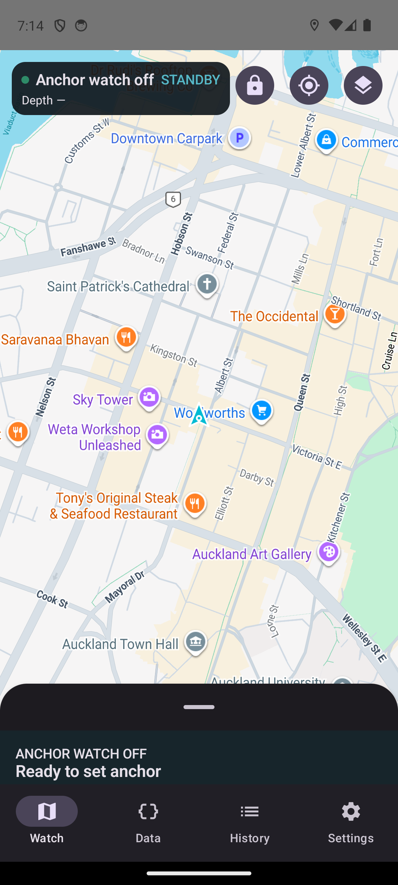
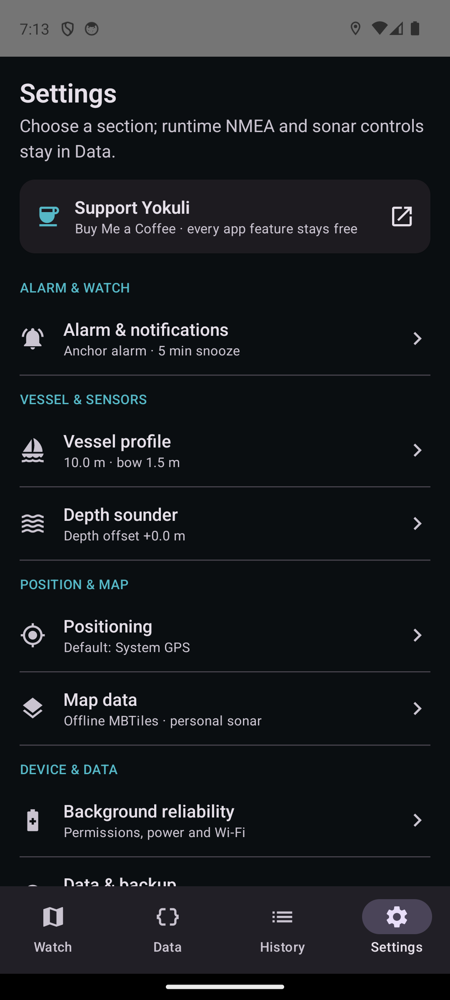
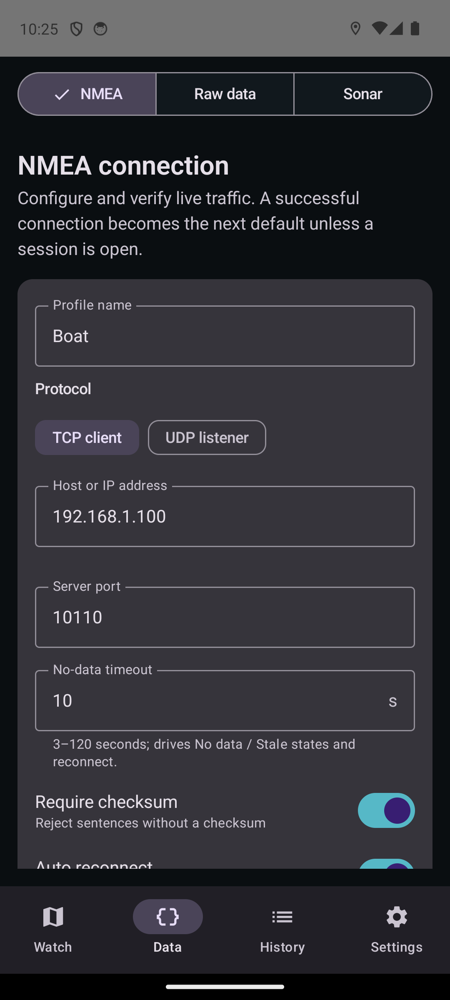

# Anchor Watch

<p align="center">
  
</p>

<p align="center">
  <a href="README.md">English</a>
  ·
  <a href="https://github.com/ohkuku/yokuli_nmea_anchor_alarm/actions/workflows/android.yml">
    
  </a>
</p>

Anchor Watch 是一款 Android 锚警与 NMEA 0183 航行数据工具。它可以接收 TCP/UDP NMEA 实时数据，监测走锚和数据中断，显示船位轨迹与原始源数据，绘制个人声呐水深，并在用户明确开启后共享或代理经过校验的位置。

> **安全提示：** Anchor Watch 只能作为辅助工具，不能替代正规的锚泊值守、航海判断、官方海图、水深仪或独立报警设备。GPS、供电、Wi-Fi、NMEA 设备和 Android 后台运行都可能失效。

App 默认使用英文；可以在欢迎页或设置中通过 🇬🇧 / 🇨🇳 切换语言。

## 产品界面

以下是当前 Android 14 Debug 版本的真实运行画面。README 已改用最新英文产品图，不再混用旧版中英文界面。

| 锚警地图 | 设置首页 |
|---|---|
|  |  |

| NMEA 输入 | 同源声呐门禁 |
|---|---|
|  |  |

## 诞生于 Yokuli 船上

走向大海以前，**kuku** 是一名程序员；来到新西兰以后，航海慢慢成了生活。我们的团队翻新了 **Yokuli**——一艘由新西兰游艇设计师 **Alan Wright** 设计的 **Lotus 10.6**。**yoyo 是船长**，kuku 和 lili 是船员。

我们想先去看看新西兰的岛屿与海湾；如果风、时间和生活都允许，也希望有一天能驶向更远的世界。Anchor Watch 正是在这段生活里长出来的。完整的锚警、NMEA、声呐与离线地图功能永久免费，不设账号、广告、付费解锁或支持者专属功能。

- [在 YouTube 看 Yokuli](https://www.youtube.com/@yokuli_ocean_diary)
- [在 Buy Me a Coffee 自愿支持船员](https://buymeacoffee.com/ukus3yya8a)——支持不会解锁任何功能。
- 功能建议与反馈：`kuku.the.developer@gmail.com`

## 主要功能

- TCP 客户端与 UDP 监听器；地址、端口和 NMEA 数据必须通过真实连接测试后才会保存并连接。
- 支持 RMC、GGA、GLL、VTG、ZDA、HDG、HDM、HDT、DPT、DBT、MWD、MWV 与常见 talker ID。
- 统一的 Accepted Position 管道；单点 GPS 跳变会先隔离，不会直接进入警报、中心估算、NMEA 共享或声呐绘制。
- 正常模式可选系统 GPS 或 NMEA GPS；没有已连接且持续提供新鲜有效定位的 NMEA 时，UI 和业务逻辑都禁止选择 NMEA。
- 持久化锚泊 session，支持暂停、原 session 恢复、监控中调整范围和永久起锚。
- 已知锚位可使用当前定位、十进制度坐标或独立地图选点器。
- 自动中心估算会综合锚链几何、多方向 GPS 覆盖、真实艏向和经过重复匹配的风向证据，宁可保持较大范围，也不会用一段直线过早定点。
- 水深、风速和风向突变环境警戒绑定当前 session；保存按钮只有在“校验后的值”确实发生变化时才可点击。
- 24 小时船舶轨迹；最新部分保持清晰，经过足够距离后才渐隐，渲染抽稀不会删除计算和历史点。
- 走锚时同时提供 App 内强制操作弹窗、循环警报、通知、稍后提醒、调整范围、暂停和起锚。
- 统一的布防前检查与持续监控健康，覆盖 GPS、NMEA、报警可听性、通知、电池、后台限制、网络、存储和声呐。
- 原始 NMEA、解析值、校验错误与连接统计查看。
- 本地收藏锚地支持详情、Google 地图打开和坐标二维码图片分享；收藏锚点只作参考，不会远程或提前下锚。
- 收藏锚地接近指引：只有用户明确收藏的位置才会形成参考聚类；进入参考范围边缘 1 海里内每次接近只提示一次，并提供醒目的直线方位与距离。它不做航线规划，也不判断航路安全。
- NMEA Sharing 可向可信船载 LAN/VPN 客户端提供经过重建和校验的位置语句，并隔离慢客户端。
- 真实个人声呐调查只使用**同一个 NMEA server**提供的水深和位置；系统 GPS 不参与真实测深点定位。
- 地图、卫星和航海三种样式，区域 LINZ 水深海图，合法的非 Google 受限缓存，以及用户授权的栅格 MBTiles。
- Room schema 导出、migration 覆盖、环形 Incident Log、存储健康、备份恢复和默认不含原始 NMEA/API key/精确船位的 Support Bundle。
- 可选 Android 全局 NMEA GPS 代理，带开发者模式、模拟位置授权检查和回环保护。

## 使用方法

1. 授予精确定位和通知权限。过夜使用前检查 **设置 → 后台可靠性**，并解除厂商电池限制。
2. 打开 **数据 → NMEA**，选择 TCP 或 UDP，填写端点，然后点击 **测试、保存并连接**。
3. 在 **数据 → 原始数据** 确认实时语句和解析坐标；连接验证成功后会自动选择 NMEA GPS。
4. 回到锚警地图，选择地图、卫星或航海；只在支持区域开启本地水深海图。
5. 点击 **下锚** 并完成 Watch Preflight。禁止项会阻止布防；警告会明确说明继续使用的风险。
6. 选择已知锚位或保守自动估算，填写报警半径和所需几何参数。
7. 监控期间可以只调整报警半径；暂停不会丢失 session；起锚会永久结束本次锚泊。
8. NMEA 锚警被动断线时，session 会保留并立即警告、尝试重连，不会静默切换 GPS 源。
9. 中心确定后，可以在 Google 地图打开精确坐标以查看或复制。
10. 再次驶近明确收藏过的锚地时，可以选择 **接近指引** 查看直线方位和距离。进入收藏参考范围后即停止指引；设置新锚警前仍要重新检查当前水深、交通、天气和障碍物。

## 报警范围与中心估算

已知锚位的基础模式直接设置半径；高级模式可以根据水深、放链长度、船艏高度和严格/均衡/宽容预设计算范围。

自动估算没有基础/高级之分：报警半径直接设置；水深、锚链和船艏高度只用于约束可能的中心。水平锚链长度为：

```text
sqrt(放链长度² - (水深 + 船艏高度)²)
```

可能中心区域一开始保持保守，只有在足够多相容的 GPS 圆盘和真正不同的方位扇区出现后才逐步收紧。方向证据只能调整概率，不能单独确认中心。即使最快的多源证据路径也要求多角度覆盖和反向运动；只有 GPS 时需要更长学习时间。高置信度结果必须由用户接受后才会移动工作中心。

完整的数学、物理和实现说明见 [锚中心点推测算法](docs/ANCHOR_CENTRE_ESTIMATION.md)。

## 地图、水深与离线策略

- 永远不会预取或缓存 Google 内容。
- 航海模式使用清淡底图与 OpenSeaMap 航标。
- LINZ 本地水深海图是独立区域图层，也是唯一具有透明度控制的海图层。
- 最近使用的 OpenSeaMap 与 LINZ 瓦片分别采用受限缓存，离线时可作为过期回退。
- 用户可导入自己有权存储和使用的栅格 MBTiles。
- 已完成调查的个人声呐网格可离线查看。

详见 [离线地图策略](docs/OFFLINE_MAPS.md) 与 [区域数据提供方](docs/REGIONAL_DATA_PROVIDERS.md)。

## 后台安全、诊断与数据

同一套安全模型会在布防前和监控期间持续运行。完整设备重启无法诚实保证 Android 定位监控从未中断：未结束的锚警会恢复到安全暂停状态，并要求用户重新确认 GPS、NMEA、报警音量、供电和网络后再继续。

Incident Log 环形保存最近的 Service 生命周期、GPS 接受/隔离/拒绝、NMEA 重连、报警状态、电池、中心、声呐和共享事件。Support Bundle 默认不包含原始 NMEA、API 凭据和精确船位。

Session 与调查数据保存在本机。项目没有账号、分析统计、广告或自建云端；只有用户主动导出备份、调查、二维码或诊断包时数据才会离开设备。

## 编译、CI 与下载

需要 JDK 17 和 Android SDK 36。仓库不提交 API 凭据；本机开发值放在未跟踪的 `local.properties`，CI 使用 GitHub Actions Secrets：

- `MAPS_API_KEY`
- `LINZ_API_KEY`（可选）
- `LINZ_HYDRO_TILE_TEMPLATE`（可选，必须为 HTTPS 且包含 `{z}`、`{x}`、`{y}`）

```bash
./gradlew assembleDebug
./gradlew testDebugUnitTest lintDebug
./gradlew connectedDebugAndroidTest
```

主 workflow 会运行单元测试、lint、Debug 编译、三个 Android 14 设备 story 分片，以及 Android 16/API 36 启动和无障碍 smoke。只有全部通过后才会发布可下载的 `anchor-watch-debug-verified-<commit SHA>` 产物；推送通过校验的版本 tag 后，正式签名包会完全在线构建并发布，网页手动 workflow 作为只需填写 tag 的兜底入口。

本项目本地规则是“修改时写测试，但只有用户明确要求时才运行”。当前 commit 对应的 GitHub Actions 结果才是完整质量门禁的权威结果。

分支与发布方法见 [分支和发布说明](docs/BRANCHING_AND_RELEASES.md)。真实过夜候选版本还必须完成 [真机与 72 小时船上 soak 清单](docs/PHYSICAL_SOAK_CHECKLIST.md)。

## 项目文档

- [产品身份](docs/PRODUCT_IDENTITY.md)
- [支持政策](docs/SUPPORT_POLICY.md)
- [隐私与数据流](docs/PRIVACY_DATA_FLOW.md)
- [可视化版本发布台](docs/RELEASE_CONSOLE.md)
- [正式版签名管理](docs/RELEASE_SIGNING.md)
- [Play 发布清单](docs/PLAY_RELEASE_CHECKLIST.md)
- [第三方声明](THIRD_PARTY_NOTICES.md)

软件许可证仍由项目所有者决定；缺少许可证文件不代表授予任何许可。
