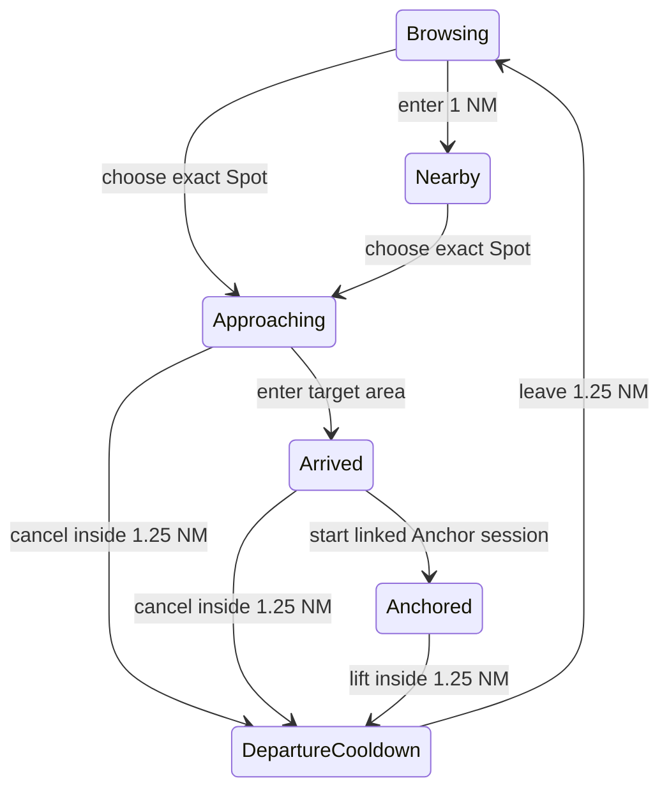

# Anchorage Library FINAL redesign report

## Release identity

- Working branch: `codex/anchorage-library-final`
- Base commit: `f22c8fe`
- State-machine/navigation commit: `ee00062`
- Final schema/library implementation commit: `e3b02a0`
- Room schema: `20 → 21`
- Backup format: remains v5; legacy adapters are retained

This report describes the checked-in implementation. Real GNSS movement, fragile NMEA hardware, TalkBack, rotation and device screenshots remain explicit manual gates rather than assumed verification.

## Product model and ownership

The live Anchorage product now uses stable normalized identities:

```text
Region → Place → Spot → Visit
                  ↘ Collection membership is independent
```

- **Region** is geographic context, not a folder that owns a Place.
- **Place** is the named anchorage/bay/cove users browse and favorite.
- **Spot** is one exact or estimated anchoring position inside a Place.
- **Visit** is an immutable historical snapshot. Editing or deleting a Spot cannot rewrite it.
- Visual marker clusters are presentation only. They never become an Approach target ID.

The legacy `saved_anchorages` table and `SavedAnchorageEntity` DTO remain only for migration, old backup/QR compatibility and a transitional Watch-detail projection. They no longer own Nearby, Approach, Arrived or active-anchor identity.

## One persisted experience state machine



The persisted state contains only episode, Place, Spot, Session and suppression IDs. Camera state and visual clusters are deliberately excluded. Its reducer enforces:

- an Approach/Arrived target cannot also be Nearby;
- an active Anchor session suppresses Nearby and Approach;
- cancel/lift inside the area starts departure cooldown;
- leaving 1.25 NM rearms discovery;
- process restoration keeps the same Place/Spot target;
- an Arrived → Set Anchor hand-off stores Place/Spot IDs on the created Anchor Session.

## Schema migration and legacy counts

Schema 21 performs these changes:

1. Renames `anchorage_personal_ratings` to `anchorage_personal_assessments`.
2. Separates imported aggregate visit history from normalized Visit cache counts.
3. Resets the incorrectly duplicated normalized cache only for legacy-migrated Place/Spot rows.
4. Keeps every old row independent: `N legacy rows → N Places → N Spots`.
5. Creates a Visit only when a valid linked source Session exists.

Count contract:

| Source data | Places | Spots | Visits | Display count |
|---|---:|---:|---:|---|
| N legacy rows | N | N | valid linked sessions only | legacy summary + normalized visits, without counting the imported linked-session baseline twice |
| QR v1/v2 | 1 per confirmed import decision | 1 | 0 | 0 until a real Visit exists |
| completed Session save | chosen/new Place | chosen/new Spot | exactly 1 per Session | normalized Visit count |

The actual user-device row counts cannot be inspected from a source checkout. The migration fixture asserts the mapping and non-duplicated count contract; QA-ANCH-008 records real before/after device counts.

## Save flow

The completed-session write path now freezes its draft before UI interaction and uses a full-screen stepped flow:

```text
1. Place / Region decision
2. Spot match or explicit new Spot decision
3. immutable Visit review and save
```

Known Session fields—coordinate and source, uncertainty, depth, rode and alarm radius—are prefilled. Place matching and Spot matching are separate. Spot matching uses coordinate uncertainty and Place identity; a fixed 75 m exception no longer blocks legitimate Spots. Existing records are not overwritten by blank input.

The repository saves Place/Spot/Visit and Session links in one Room transaction. Success names the exact Place and Spot and offers **View** and transaction-scoped **Undo**. Undo removes only rows created by that completed transaction.

### Save-flow screenshot gate

New screenshots were intentionally not fabricated from source. Capture the following during QA-ANCH-004 on English and Chinese builds:

1. frozen Session values and Place decision;
2. explicit likely-same/new Spot choice;
3. success page with exact Place/Spot and Undo.

These remain `UNVERIFIED_UI` until captured on the supported device size/font matrix.

## Protection model and UI

Wind and swell are two independent sets of eight compass sectors. Each sector persists:

```text
medium + direction + UNKNOWN/GOOD/PARTIAL/EXPOSED
+ evidence source + confidence + notes + updatedAt
```

The detail page uses separate Wind/Swell modes and a 3×3 compass layout with an anchor at the centre. Status is expressed with text, icon and colour. Selecting a sector opens an editor for rating, evidence source and notes; it no longer silently cycles values. `UNKNOWN` remains distinct from `EXPOSED`.

Protection is a Place-level observation. Visit wind/depth/motion observations are immutable evidence and never automatically overwrite Protection. QR v2 may carry up to 16 protection sectors but never Visit history.

## Map-first library and details

- Anchor → Anchorages defaults to Map.
- Map and List consume the same repository state, search, Region and filters.
- Low zoom aggregates by Region; medium zoom resolves Places; high zoom can show Spots for the selected Place.
- Panning or zooming does not open details. Marker tap opens a compact Place sheet first; **View details** opens a full-screen scrollable Place/Spot/Visit/Photo/Notes surface.
- An empty viewport remains empty instead of unexpectedly rendering every Place.
- Filters include favorite, visited, frequent and planning status.
- Raw coordinates are supporting metadata, never the primary Place-card title.

The deterministic aggregation gate exercises 10,000 map Places and verifies that marker models are reduced before rendering. Device performance for the requested 1,000 Places / 5,000 Spots / 10,000 Visits dataset remains QA-ANCH-007.

## Nearby and Approach behavior

- Nearby uses one compact normalized Place/Spot banner.
- One Place/one Spot offers a direct action; multiple Places/Spots require an explicit target.
- Approach uses the stable Spot ID and is a full-screen destination.
- Entering the target area becomes Arrived without producing a second Nearby prompt.
- Cancel and lift suppress the current Place until it leaves the 1.25 NM rearm radius.
- Direction can still use the product's Phone/Vessel heading policy; the Anchorage target identity is independent of heading-source changes.

## GIS provider status

The Region provider contract and LINZ Gazetteer implementation remain offline-safe. Cached/user-confirmed Region assignments continue working without network access. Provider candidates are suggestions: the save flow requires user confirmation and never silently rewrites a Place. Unassigned Places remain browsable.

## Backup and QR compatibility

- Backup v5 continues to include normalized Region/Place/Spot/Visit/Collection/Protection/assessment/summary records and private photos.
- The historical backup path name for personal ratings is intentionally retained as an archive compatibility key even though the Room table is now `anchorage_personal_assessments`.
- QR v1 is accepted as an unverified imported Place/Spot.
- QR v2 validates coordinates, lengths, strings and unique protection sector keys; it imports no Visit history.
- Google Maps coordinates/plain coordinate payloads remain readable by the legacy adapter.

## Verification

| Gate | Result |
|---|---|
| Anchorage JVM unit tests | passed |
| Full Debug JVM unit tests | 532 passed, 0 failed, 0 skipped |
| Unit/instrumentation Kotlin compilation | passed |
| Room migration instrumentation | compiled; not executed locally |
| Android lintDebug | passed |
| Debug APK | passed; `app/build/outputs/apk/debug/app-debug.apk` |
| Emulator/real device | not run; use `docs/MANUAL_QA_CHECKLIST.md` |

Primary automated coverage includes state transitions/restoration, uncertainty matching, 80 m distinct Spot creation, transactional save/undo, existing Place+Spot Visit-only save, immutable Visit coordinates, 16-sector protection round-trip, QR validation, migration 19→20→21 and high-volume visual aggregation.

## Known limitations

- Real-device movement is required to validate the 1 NM/1.25 NM geofence experience and live heading presentation.
- TalkBack, large fonts, rotation and modal-sheet stacking require the manual accessibility matrix.
- New save-flow screenshots are pending manual UI QA.
- The legacy table/DTO cannot be deleted until the documented backup and compatibility window ends.
- GIS suggestions depend on available cached or online provider data; they are never a substitute for official charts or safe-navigation judgement.
