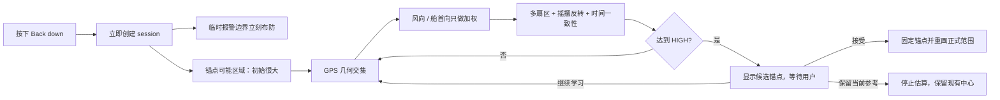
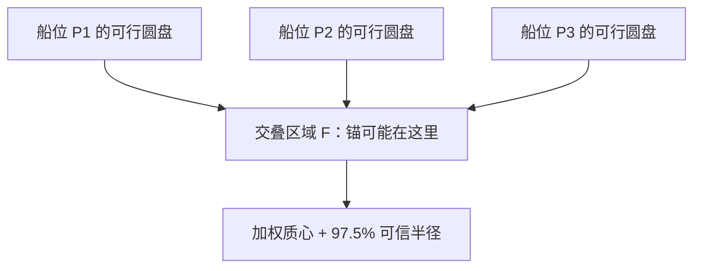
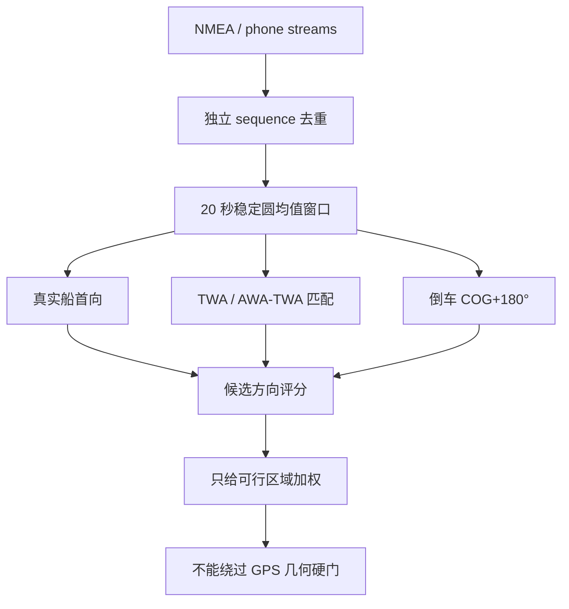

# Yokuli 锚中心点推测算法说明

> 文档对应 Room schema v11 / 当前 `BackdownCenterEstimator` 实现。它描述的是 Yokuli 自己的保守估算器，不声称复制 Garmin 或其他厂商未公开的专有算法。

## English abstract

Yokuli does not infer an anchor centre from a single straight back-down leg. It first maintains a **feasible anchor region**: every accepted vessel position constrains the anchor to a disc whose radius is the horizontal rode reach. A robust partial-circle fit is considered only after the vessel has occupied many angular sectors, completed meaningful swing reversals, remained temporally consistent, and accumulated enough independent time/samples. Physical heading and repeated wind-derived heading can accelerate evidence collection, but can never resolve the centre alone. A high-confidence result is presented as a candidate; the working alarm boundary does not move until the user accepts it.

## 1. 要解决的真实问题

船的 GPS 天线记录的是船位 (P_i)，不是锚 (A)。锚链在海床、悬链线、潮流、阵风和船体偏航共同作用下，使瞬时半径 (r_i=\lVert P_i-A\rVert) 持续变化。因此：

- 一条直线轨迹可以对应无穷多个圆心，不能唯一确定锚点；
- 一小段圆弧的圆拟合在数学上病态，微小 GPS 噪声能把圆心推到很远；
- COG 是运动方向，不等于船首向，低速时尤其不可靠；
- AWA/TWA/AWS/TWS 可能来自仪器计算值，不一定是相互独立的传感器证据；
- 锚警必须从按下开始按钮的那一刻就工作，不能等十几分钟才提供保护。

所以本算法把问题拆成两个互不混淆的输出：

1. **工作报警边界**：立即生效，以开始位置为临时参考，绝不跟着尚未确认的圆心乱跳。
2. **锚点可能区域/候选中心**：只用于学习和提示；高置信度后仍需用户确认，才替换工作中心。

## 2. 物理约束：锚链给出的不是圆心，而是上界

设：

- 放出锚链长度 (L)；
- 仪器水深 (d)；
- 船艏锚链导轮高出水面 (h)；
- GPS 天线到船艏的补偿 (o)。

忽略悬链线细节时，锚链可达到的最大水平投影为：

$$
R_h=\sqrt{\max(0,L^2-(d+h)^2)}+o
$$

这不是“船一定在半径 (R_h) 的圆上”，而是保守约束：

$$
\lVert A-P_i\rVert \le R_h + m_{gps}
$$

其中 (m_{gps}) 是由 reported accuracy、HDOP 和降级定位比例得到的 GPS 余量。当前实现把它限制在 3–30 m；没有质量字段时默认 12 m。

对每个可信船位 (P_i)，锚点都应该落在以 (P_i) 为圆心、(R_h+m_{gps}) 为半径的圆盘中。真正可行区域是这些圆盘的鲁棒交集：

$$
\mathcal F=\bigcap_i D(P_i,R_h+m_{gps})
$$

实现允许最多 `max(2, 5% samples)` 不满足约束，避免少量未被前置完整隔离的 GPS 毛刺把交集清空。

### 初始蓝圈为什么必须很大

开始时信息接近零。正常 Back down 流程已经由水深、锚链与船艏高度算出水平可达上界，因此当前 session 的初始可能半径取：

$$
R_0=\max(R_h,25\text{ m})
$$

`25 m` 是代码的最低保守尺度，不是对真实锚链长度的猜测；用户提供的几何参数有效时，(R_h) 才是主导项。仅供旧数据/测试兼容的无几何参数入口会暂用 `max(25 m, 1.25 × 已观察轨迹直径)`，但产品 UI 不把这个 fallback 当作正常的自动估算方式。

之后的不确定度还有一个随证据进度下降的保守下限，不允许几何拟合在证据不足时突然给出小圈：

$$
U_{floor}=\max\left(m_{gps}(1+q_d),R_h(1-0.90e)+0.15R_hq_d\right)
$$

- (q_d)：降级 fix 比例；
- (e\in[0,1])：样本、有效时间、角覆盖、扇区和反转数中最弱一项形成的证据进度。

这就是“宁可先大，不提前装作准确”的硬性机制。

## 3. 地理坐标与局部平面

几十到几百米尺度内，算法以样本纬经度中位数为局部原点，将 WGS‑84 经纬度近似投影到 East/North 米坐标：

$$
x=(\lambda-\lambda_0)\,111320\cos\phi_0
$$

$$
y=(\phi-\phi_0)\,110540
$$

报警距离本身使用 Haversine 大圆距离；局部平面只用于区域扫描和圆拟合。锚泊尺度上这种分工避免了直接在“度”上做欧氏几何，也不必引入重型 GIS 投影运行时。

对于跨越反经线、高纬极区或公里级轨迹，当前近似不成立；这些都不是本锚泊估算器的设计范围。

## 4. 数据入口与质量门

进入估算器之前，fix 还要经过 App 的 Accepted Position 管线。估算器自身再次拒绝：

- 纬经度越界；
- `REJECTED` 或 `QUARANTINED`；
- HDOP > 8；
- reported horizontal accuracy > 100 m。

连续高频数据不会无限增长计算量：区域扫描均匀抽样到 160 点，圆拟合均匀抽样到 800 点；长期 session 的内存历史还会保留全部近期样本并稀疏化较老样本。Room 中的原始轨迹仍然保留，不因视觉淡化或内存压缩而消失。

“有效时间”也不是简单的尾时间减头时间。相邻样本间隔只有在 1–15 秒内才累计：

$$
T_{eff}=\sum_i \begin{cases}
\Delta t_i,&1\text{s}\le\Delta t_i\le15\text{s}\\
0,&\text{otherwise}
\end{cases}
$$

因此断线十分钟不会被假装成十分钟有效观察。

## 5. 两阶段中心估算

### 阶段 A：可行区域扫描

1. 在 ([-R_h,R_h]^2) 上做 24×24 粗扫描；
2. 丢弃违反过多圆盘约束的候选；
3. 在粗扫描包围盒外扩一个格距，再做 48×48 细扫描；
4. 风/船首向证据只改变候选权重：

$$
w_j=\exp(1.6\,s_{dir}(A_j))
$$

5. 取加权质心，并以累计权重 97.5% 的距离作为可信区域半径，再叠加 GPS 余量和保守 floor。

这一步对“直线倒车”是安全的：直线会让可行区域变窄一些，但仍沿横向保持很大，不会谎称找到了唯一圆心。

### 阶段 B：抗离群局部圆拟合

只有至少 20 个点、20 秒有效数据、轨迹直径至少 10 m 时才尝试拟合。圆拟合过程：

1. RANSAC 随机取三点求外接圆，固定执行 400 次；
2. 半径必须在 2–2000 m；
3. 初始 inlier 容差为 `max(3.5 m, 12% radius)`；
4. 至少 `max(12, 65% samples)` 为 inlier；
5. 对 inlier 做代数最小二乘，再进行 3 轮 `max(3 m, 10% radius)` 收紧；
6. RMS 只使用残差较小的 90%，降低孤立毛刺影响。

局部圆拟合还必须满足：

- 角覆盖至少 90°；
- 拟合中心和几何可行区域中心的距离不超过 `max(20 m, 55% horizontal rode)`；
- 拟合半径不超过水平锚链上界 + GPS margin。

否则拟合结果不会接管区域中心。

## 6. 为什么“转过一个方向”仍然不够

### 角覆盖

把船位相对候选中心的方位角排序，找到最大空白角 (g_{max})：

$$
C_{angle}=360^\circ-g_{max}
$$

HIGH 要求至少 200°，同时在 12 个 30° 扇区中占据至少 8 个。算法对分箱起点做 0/5/10/15/20/25° 六种旋转，避免点恰好落在边界导致丢扇区。

### 有意义的摇摆反转

仅保留离候选中心至少 `max(5 m, 20% horizontal rode)` 的点；展开 0/360° 方位角、滑窗平滑后，把累计方向变化至少 20° 才算一条摇摆腿。相邻摇摆腿方向相反才算一次反转。

直线后退、单向弧、GPS 抖动都不能满足这个门。

### 时间一致性

历史按时间一分为二，前半段和后半段分别独立拟合。两半都必须：

- 覆盖至少 120°；
- RMS ≤ `max(5 m, 14% horizontal rode)`；
- 两个圆心相距 ≤ `max(7 m, 15% horizontal rode)`；
- 两个半径差 ≤ `max(8 m, 20% horizontal rode)`。

这防止“一阵风下的一小段漂亮圆弧”直接决定整晚锚点。

## 7. 风、船首向和 COG 如何参与

证据强度从高到低：

| 来源 | 当前权重 | 使用条件 | 含义 |
|---|---:|---|---|
| 真实/手机船首向 | 1.00 | 独立序列、稳定窗口 | 船艏通常朝向锚的方向 |
| AWA≈TWA 且 AWS≈TWS | 约 0.80–0.92 | 风速 ≥3.5 kn、多次独立匹配 | 低船速时视风接近真风，可辅助恢复船艏方向 |
| 有 TWA 的风证据 | 约 0.68–0.92 | 风速 ≥3.5 kn | 由真风方向与真风角推测船艏 |
| 静止时 AWA | 约 0.48–0.63 | SOG ≤0.35 kn、风速匹配 | 较弱的近静态推测 |
| 倒车 COG+180° | 0.42 | SOG ≥0.8 kn | 只在明显倒车腿上作弱证据 |

任何单条 NMEA 风句都不会直接成为方向证据。原始方向先按 20 秒桶组成稳定窗口：

- 每窗至少 5 个独立样本；
- 窗内跨度至少 6 秒；
- 圆均值集中度至少 0.88；
- 真实船首向至少 3 窗并跨 30 秒；
- 风证据至少 4 窗并跨 45 秒。

候选中心与这些方向观测的加权匹配要求：70% 权重误差不超过 32°，中位角误差不超过 22°。

重要限制：方向证据只改变“可行区域里哪个位置更像”，绝不单独创建 HIGH。即使 AWA=TWA、AWS=TWS 完美成立，也仍要通过空间覆盖、摇摆反转、圆拟合和时间一致性。

## 8. 5 分钟、8 分钟、15 分钟到底代表什么

算法不是“到时间就出结果”，而是时间、样本、空间与一致性同时满足。

| 证据组合 | 最短有效时间 | 最少样本 | 反转要求 |
|---|---:|---:|---:|
| 真实船首向 + 重复独立风证据一致 | 5 min | 300 | ≥1 |
| 真实船首向或重复风证据一致 | 8 min | 480 | ≥2 |
| GPS 为主，方向证据不足 | 15 min | 600 | ≥2 |

三种路径都还必须同时达到：

- 圆拟合本身为 HIGH；
- 方位覆盖 ≥200°；
- 扇区 ≥8；
- 前后半段拟合一致；
- 最终不确定度 ≤ `max(10 m, 22% horizontal rode)`；
- 存在方向加速时，候选必须与方向证据一致。

所以“五分钟”只是理论最快路径，不是保证。船只在一个方向运动五分钟，结果仍应保持学习中。

## 9. 候选、用户确认和报警边界

HIGH 结果只创建 `CANDIDATE_READY`：

- 地图显示候选锚点和可能范围；
- 临时工作报警圈不自动跳到新圆心；
- 用户可接受、继续估算、或保留当前中心；
- 接受后才把 `anchorLatitude/Longitude` 改为候选值、清空学习区域并重置正式报警几何。

候选更新还必须显著改善：首次预览至少缩小 3%；已有候选之后通常需要不确定度缩小 15%，且 RMS、角覆盖、扇区、时间一致性不能明显变差。

这样可以防止候选图标随着每个 GPS fix 来回跳。

## 10. 慢性走锚趋势与正式报警的关系

多个 HIGH 候选若持续朝同一方向移动，会产生“可能慢性走锚”建议事件。但它不是正式越界报警，因为：

- 风向改变会真实改变拟合偏差；
- 锚链重新铺设会让轨迹圆发生偏移；
- 小角度数据仍可能制造缓慢漂移的拟合中心。

正式安全判断始终由已经布防的半径、GPS 丢失/质量报警和用户确认后的中心负责。趋势只提醒人工检查，不能替代锚警。

## 11. 失败模式与保守退化

| 场景 | 算法行为 |
|---|---|
| 只直线倒车 | 缩小部分可行区域，但不会 HIGH |
| 只摆一个小角度 | 圆拟合可能存在，但覆盖/扇区失败 |
| 风很小 | 不使用风证据，退回更长的 GPS-only 时间窗 |
| AWA/TWA 由同一计算链产生 | 独立 sequence + 多窗口只能降低重复计数风险，不能证明物理独立；因此仍不能单独解算 |
| GPS 跳点 | 前置 quarantine/reject + 5% 区域容错 + RANSAC |
| 长时间断线 | 断线空档不计有效时间；正式 GPS loss alarm 独立工作 |
| 锚链/水深填写错误 | 物理上界会错误；UI 必须要求 Back down 参数，并由用户对仪器 offset 负责 |
| 船首传感器安装方向错误 | 方向一致性可能失败，算法退化变慢；不应强行旋转数据“凑中心” |

## 12. 参数追踪表（当前代码常量）

| 参数 | 当前值 |
|---|---:|
| 开始拟合的最少点数 | 20 |
| 开始拟合的最短有效时间 | 20 s |
| 最小轨迹直径 | 10 m |
| 区域扫描 | 24×24 粗 + 48×48 细 |
| 区域允许违反约束 | max(2, 5%) |
| 区域可信权重 | 97.5% |
| RANSAC 次数 | 400 |
| RANSAC 最小 inlier | max(12, 65%) |
| HIGH 最小角覆盖 | 200° |
| HIGH 最小 30° 扇区 | 8/12 |
| 时间分半各自最小覆盖 | 120° |
| 候选不确定度上限 | max(10 m, 22% (R_h)) |
| 风证据最低风速 | 3.5 kn |
| 稳定方向窗 | 20 s bucket；≥5 样本；跨度 ≥6 s；集中度 ≥0.88 |

## 13. 仍值得讨论的优化方向

1. **悬链线模型**：结合链重、海底摩擦、潮流和张力，而不是只用直角三角形上界。
2. **概率滤波**：把网格可行域升级为粒子滤波/贝叶斯后验，显式维护多峰分布。
3. **传感器相关性图**：识别 TWA/TWS 是否由同一 MFD 从 AWA、船速计算，避免把派生值当独立证据。
4. **潮汐分段模型**：转流前后分别建模，避免把两种受力平衡硬塞进一个圆。
5. **船型先验**：单体、双体、长龙骨船的偏航频谱不同，但默认必须保持无先验也安全。
6. **离线回放评估集**：用已知锚点的长时 NMEA 记录做 blind validation，统计中心误差、首次候选时间、误候选率。
7. **自适应停止规则**：当后验区域连续多个窗口不再缩小，明确告诉用户“当前环境无法可靠确认”，而不是永远显示学习中。

## 14. 代码入口

- `domain/anchor/BackdownCenterEstimator.kt`：可行区域、证据门、不确定度与 HIGH 判定。
- `domain/anchor/AnchorCenterEstimator.kt`：RANSAC + 最小二乘局部圆拟合。
- `domain/anchor/WindAnchorEvidence.kt`：物理船首向、风和倒车 COG 的稳定窗口。
- `runtime/anchor/AnchorWatchRuntime.kt`：session、临时边界、候选确认与报警分离。
- `domain/anchor/AnchorGeometry.kt`：大圆距离、方位与水平锚链几何。

这份文档应与上述代码一起评审；任何阈值变化都应同步修改测试和本文参数表。
