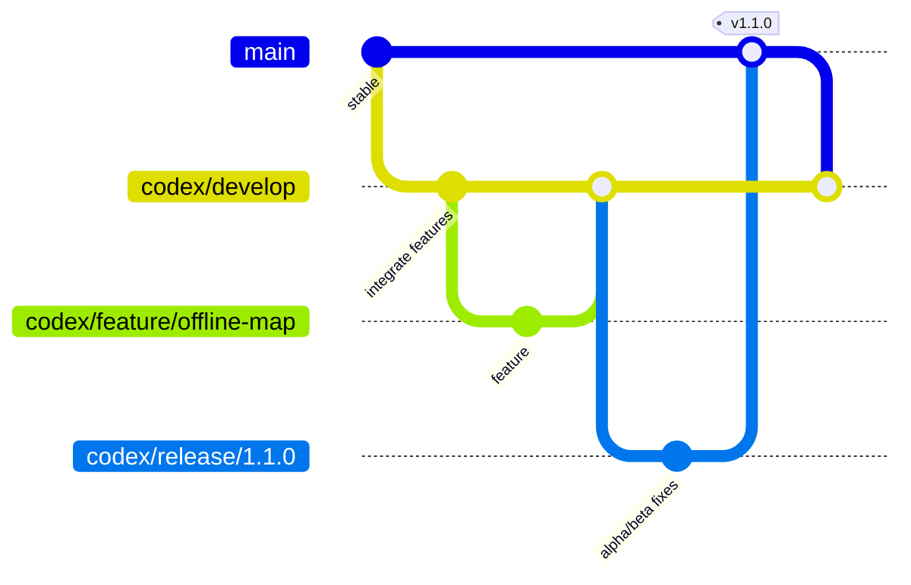

# Branching and release model / 分支与发布模型

## 中文

### 分支职责

| 分支 | 用途 | 允许发布 |
|---|---|---|
| `main` | 已验证、可正式发布的稳定线；禁止直接做日常开发 | stable；必要时 beta |
| `codex/develop` | 当前集成开发线；所有已完成 feature 在这里合流 | 每次 push 生成可下载 verified Debug；允许 alpha |
| `codex/feature/<name>` | 单一功能或修复，生命周期短 | CI Debug，不做正式 release |
| `codex/release/<x.y.z>` | 从 develop 冻结出的发布候选，只收缺陷修复、版本号和文档 | alpha / beta |
| `codex/hotfix/<name>` | 从 main 拉出，处理正式版紧急缺陷 | 合回 main 和 develop 后发布 stable |

`codex/` 前缀明确表示这些分支由当前 Codex 开发流程管理；不改变 Git 的技术能力，也不代表代码质量等级。

### 日常开发流程

1. 从 `codex/develop` 创建 `codex/feature/<name>`。
2. feature push 会运行 Unit、Lint、Debug 编译、三片 Android 14 设备集成测试与 API 36 smoke。
3. 只有 CI 通过才合回 `codex/develop`。
4. `codex/develop` 每次 push 产生两个有明确含义的产物：
   - `candidate`：只通过 Unit/Lint/编译，还没通过全部设备 story；
   - `development-debug` / `debug-verified`：全部三片设备 story 与 API 36 smoke 通过，可供开发试用下载。
5. 失败构建若仍成功编译，只会上传 7 天的 `UNVERIFIED` 诊断 APK，绝不能当作可用版本传播。

### Alpha、Beta、Stable

- **Alpha**：功能仍可能变化。来源只能是 `codex/develop` 或 `codex/release/*`，tag 为 `vX.Y.Z-alpha.N`。
- **Beta**：功能冻结，只修发布阻断缺陷。来源是 `codex/release/*`（特殊情况下 main），tag 为 `vX.Y.Z-beta.N`。
- **Stable**：来源只能是 `main`，tag 必须是 `vX.Y.Z`，不能带预发布后缀。

GitHub 的 `Publish Anchor Watch Release` 手动 Action 会验证“当前分支 + channel + tag”组合；组合不合法会在构建和签名前直接失败。之后它会跑完整设备 story、Unit、Release Lint，生成签名 APK/AAB、校验签名和 SHA‑256，再创建 GitHub Release。

### 版本合并规则

- release 分支发布 stable 后，必须把 main 合回 `codex/develop`，防止发布修复丢失。
- hotfix 从 main 开始，修复后同时合回 main 与 develop。
- 不对共享分支 force-push；不删除 main 上的正式 tag。
- Android `versionCode` 永远递增；`versionName` 与 tag 去掉开头 `v` 后一致。
- Release signing key 只存在于 GitHub Actions secrets，不提交进仓库。

### 下载开发包

进入 GitHub → Actions → `Anchor Watch Android CI` → 选择 `codex/develop` 最近一次绿色运行 → Artifacts，下载：

`anchor-watch-development-debug-<run>-<sha>`

Debug APK 使用调试签名，不能覆盖由正式签名安装的 stable APK；测试前应确认当前设备上安装的是哪一种签名。

## English

### Branch roles

| Branch | Purpose | Release eligibility |
|---|---|---|
| `main` | Fully verified stable line; no routine development | stable, exceptionally beta |
| `codex/develop` | Integration branch for completed features | verified Debug on every push; alpha |
| `codex/feature/<name>` | Short-lived single feature/fix | CI Debug only |
| `codex/release/<x.y.z>` | Frozen release candidate from develop | alpha / beta |
| `codex/hotfix/<name>` | Urgent production repair from main | stable after merging back to both lines |

### Normal flow

1. Branch a feature from `codex/develop`.
2. Pushes run unit tests, lint, Debug compilation, three Android 14 device-test shards and an API 36 smoke.
3. Merge only green work back to `codex/develop`.
4. Every green develop push publishes a 45-day `development-debug` artifact. A candidate artifact is not equivalent to a device-verified artifact.
5. Freeze a planned release into `codex/release/X.Y.Z`; publish alpha/beta tags while fixing only release blockers.
6. Merge the release branch to `main`, then publish stable `vX.Y.Z` and merge main back into develop.

### Channel rules enforced by CI

- alpha: `codex/develop` or `codex/release/*`; `vX.Y.Z-alpha.N`
- beta: `codex/release/*` or main; `vX.Y.Z-beta.N`
- stable: main only; `vX.Y.Z`

The release workflow performs the full device story gate before signing. It then runs JVM tests and Release Lint, builds signed APK/AAB files, verifies the APK signature, emits SHA‑256 checksums, and creates a GitHub Release. Non-stable channels are always marked as pre-releases.

### Recovery rules

- Never force-push shared integration/release branches.
- Hotfix from main and merge the fix into both main and develop.
- Keep production tags immutable.
- Keep signing material only in GitHub Actions secrets.
- A failing build may expose a clearly named `UNVERIFIED` diagnostic APK for troubleshooting; it is not a distributable test release.
