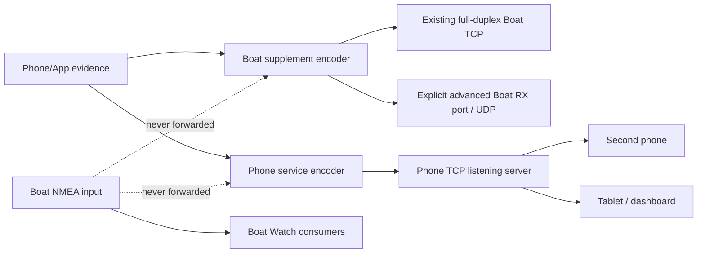

# Boat Watch NMEA product boundaries / NMEA 产品边界

Status: implemented on `codex/develop` · 2026-08-26  
Scope: Phone/App-created NMEA only. Direct Boat input is never repeated.

## The two products are not transport modes

| Product | User goal | Network role | Opens | Depends on Boat RX | Start/Stop owner |
|---|---|---|---|---|---|
| Boat-network supplement | Fill measurements missing from the current boat network | TCP/UDP writer | Existing full-duplex input Socket by default; explicit separate gateway RX endpoint only as Advanced | Same-socket mode: yes; separate gateway endpoint: no | `OutputSettingsRepository` + `AnchorWatchNmeaPublisher` |
| Phone NMEA service | Let another phone/tablet/laptop/dashboard consume this phone's data | TCP listener/server | A listening Socket on this phone; downstream clients connect to it | No | `LocalNmeaServerSettingsRepository` + `LocalNmeaServerRuntime` + `NmeaSharingServer` |

They may run together. They share the Phone/App-owned encoder rules, but **not**
configuration, runtime lease, Socket ownership, connection state, errors, raw
history or Stop behavior.

## Product 1 — Boat-network supplement / 船网补缺发送

### Contract

- Normal route: write through the already-open full-duplex TCP input Socket.
  This never creates a second connection to a fragile single-client gateway.
- Advanced route: create a separate TCP client only when the gateway documents
  a different receive port; UDP unicast/broadcast remain explicit advanced
  choices.
- A TCP listener is not a valid destination here. Historical `TCP_SERVER`
  settings migrate, stopped, to Phone NMEA service.
- Formal Start requires vessel-zero, current mount confirmation and matching
  heading alignment. A later mount warning keeps the route alive but suppresses
  unsafe Heading/Motion; independent Position/Pressure continue.
- Output is 1 Hz, latest-value-only and coalesced into one physical write per
  tick. A blocked converter cannot accumulate a catch-up log.
- Stop owns the hard write barrier. It has no reference to the phone-hosted
  server, so it cannot close that listener or its clients.

### Eligible data

- Android GNSS Position/SOG/COG/time from one atomic, real, non-mock fix.
- Calibrated Phone vessel Heading and Phone IMU motion.
- Phone barometer when valid.
- True wind only when explicitly produced by Boat Watch as `APP_DERIVED`.
- Never Boat Position, Boat Heading, Boat wind, Depth, STW, or another direct
  NMEA observation.

## Product 2 — Phone NMEA service / 本机 NMEA 服务

### Contract

- Listens on this phone's Wi-Fi/hotspot interfaces; it does not connect to the
  Boat gateway.
- Starts only from its own explicit Start action. Saving a port cannot open or
  close a Socket, and process restore does not auto-start it.
- Zero clients is a healthy `RUNNING` state, not an error and not a reason to
  stop. Each client has a bounded queue; a slow or failed client is isolated.
- Duplicate rapid Start requests are serialized and idempotent. Start/Stop is
  one lifecycle transaction, preventing the old `STARTING → STOPPED` 1 ms race.
- Uses the same eligible-data contract above, but owns a separate encoder lease
  bank and heartbeat. Starting/stopping Boat supplement cannot reset its held
  values or generation.
- UI separately shows listening addresses, connected clients, locally generated
  lines and lines actually flushed to clients.

## 中文产品说明

### 船网补缺发送

这是“手机主动写入已有船载 NMEA 网络”的功能。它的目标不是转发船网已有
数据，而是补充手机 / Boat Watch 自己能够提供、船网上当前缺少的数据。默认
复用已连接的全双工 TCP；只有网关明确提供另一个接收端口时，用户才应开启
独立 TCP 客户端。它没有监听端口，也不会供其他设备来连接。

### 本机 NMEA 服务

这是“手机本身成为 NMEA TCP 服务器”的功能。另一台手机、平板、电脑或
Dashboard App 主动连接本手机的 IP 与监听端口。它不依赖船载 NMEA 输入，
即使船网 RX 完全关闭也可工作；没有客户端时仍应持续监听。它与船网补缺
发送拥有完全独立的配置、启动状态和 Socket 生命周期。

## Lifecycle invariants / 生命周期硬约束

1. Saving either configuration never starts either runtime.
2. Stopping Boat RX stops same-socket supplement only through the guarded
   dependency story; it never stops Phone NMEA service.
3. Stopping Phone NMEA service closes its listener/clients and cannot stop Boat
   RX or Boat supplement.
4. Starting one product cannot overwrite the other's port or running state.
5. A stale legacy TCP-server output route is blocked below UI and migrated once.
6. Both products apply the same provenance firewall but use separate stateful
   encoders, so one product's reset cannot blank the other.

## Manual hardware acceptance

- Run Boat RX alone; confirm one formal gateway connection.
- Start same-socket supplement; confirm connection count remains one and 1 Hz
  Phone fields remain stable when Raymarine joins.
- Start Phone NMEA service simultaneously; connect a second dashboard device;
  confirm the Boat gateway connection count does not change.
- Stop Boat supplement; confirm the second dashboard continues receiving.
- Stop Phone NMEA service; confirm Boat RX and supplement continue.
- With no phone-service clients, leave it listening for ten minutes; it must not
  self-stop or increment “flushed” count.

