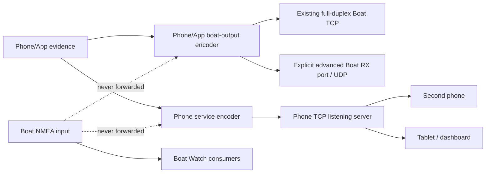

# Boat Watch NMEA product boundaries / NMEA 产品边界

Status: implemented on `codex/develop` · 2026-08-26  
Scope: Phone/App-created NMEA only. Direct Boat input is never repeated.

## The two products are not transport modes

| Product | User goal | Network role | Opens | Depends on Boat RX | Start/Stop owner |
|---|---|---|---|---|---|
| Phone/App boat output | Publish every currently valid Phone/App-owned value to the boat network | TCP/UDP writer | Existing full-duplex input Socket by default; explicit separate gateway RX endpoint only as Advanced | Same-socket mode: yes; separate gateway endpoint: no | `OutputSettingsRepository` + `AnchorWatchNmeaPublisher` |
| Phone NMEA service | Let another phone/tablet/laptop/dashboard consume this phone's data | TCP listener/server | A listening Socket on this phone; downstream clients connect to it | No | `LocalNmeaServerSettingsRepository` + `LocalNmeaServerRuntime` + `NmeaSharingServer` |

They may run together. They share the Phone/App-owned encoder rules, but **not**
configuration, runtime lease, Socket ownership, connection state, errors, raw
history or Stop behavior.

## Product 1 — Phone/App boat output / 发送手机与 App 数据

### Contract

- Normal route: write through the already-open full-duplex TCP input Socket.
  This never creates a second connection to a fragile single-client gateway.
- Advanced route: create a separate TCP client only when the gateway documents
  a different receive port; UDP unicast/broadcast remain explicit advanced
  choices.
- A TCP listener is not a valid destination here. Historical `TCP_SERVER`
  settings migrate, stopped, to Phone NMEA service.
- Formal Start requires the durable phone-to-bow heading alignment. A Trip
  attitude placement is independent: only the Motion family is absent while
  the user has not confirmed or has manually paused that Trip segment.
- Every currently valid Phone/App-owned family publishes continuously. It does
  not yield when a Boat value of the same kind appears. Source preference and
  failover belong to the receiving Raymarine/Simrad/dashboard device.
- Output is 1 Hz, latest-value-only and coalesced into one physical write per
  tick. A blocked converter cannot accumulate a catch-up log.
- The publisher installs a short in-flight echo barrier **before** socket IO and
  promotes it only after a successful write. Confirmed exact/semantic echoes are
  occurrence-bounded so a genuinely independent instrument that happens to
  report the same value cannot be hidden indefinitely.
- Stop owns the hard write barrier. It has no reference to the phone-hosted
  server, so it cannot close that listener or its clients.

### Eligible data

- Android GNSS Position/SOG/COG/time from one atomic, real, non-mock fix.
- Calibrated Phone vessel Heading and Phone IMU motion.
- Phone barometer when valid.
- True wind only when explicitly produced by Boat Watch as `APP_DERIVED`.
- Never Boat Position, Boat Heading, Boat wind, Depth, STW, or another direct
  NMEA observation.

## Product 2 — Phone NMEA service / 本机 NMEA 服务

### Contract

- Listens on this phone's Wi-Fi/hotspot interfaces; it does not connect to the
  Boat gateway.
- Starts only from its own explicit Start action. Saving a port cannot open or
  close a Socket, and process restore does not auto-start it.
- Zero clients is a healthy `RUNNING` state, not an error and not a reason to
  stop. Each client has a bounded queue; a slow or failed client is isolated.
- Duplicate rapid Start requests are serialized and idempotent. Start/Stop is
  one lifecycle transaction, preventing the old `STARTING → STOPPED` 1 ms race.
- Uses the same eligible-data contract above, but owns a separate encoder lease
  bank and heartbeat. Starting/stopping Phone/App boat output cannot reset its held
  values or generation.
- UI separately shows listening addresses, connected clients, locally generated
  lines and lines actually flushed to clients.

## 中文产品说明

### 发送手机与 App 数据

这是“手机主动写入已有船载 NMEA 网络”的功能。它的目标不是转发船网已有
数据，而是持续发送手机 / Boat Watch 自己能够提供的所有有效数据。即使船网
同时出现同类数据，App 也不会自动让位；最终选择和切换来源由接收端仪表负责。默认
复用已连接的全双工 TCP；只有网关明确提供另一个接收端口时，用户才应开启
独立 TCP 客户端。它没有监听端口，也不会供其他设备来连接。

### 本机 NMEA 服务

这是“手机本身成为 NMEA TCP 服务器”的功能。另一台手机、平板、电脑或
Dashboard App 主动连接本手机的 IP 与监听端口。它不依赖船载 NMEA 输入，
即使船网 RX 完全关闭也可工作；没有客户端时仍应持续监听。它与手机 / App 船网
输出拥有完全独立的配置、启动状态和 Socket 生命周期。

## Lifecycle invariants / 生命周期硬约束

1. Saving either configuration never starts either runtime.
2. Stopping Boat RX stops same-socket Phone/App output only through the guarded
   dependency story; it never stops Phone NMEA service.
3. Stopping Phone NMEA service closes its listener/clients and cannot stop Boat
   RX or Phone/App boat output.
4. Starting one product cannot overwrite the other's port or running state.
5. A stale legacy TCP-server output route is blocked below UI and migrated once.
6. Both products apply the same provenance firewall but use separate stateful
   encoders, so one product's reset cannot blank the other.
7. An MFD displaying a Phone-originated value does not by itself make that value
   a new Phone/App source. Echo evidence remains bounded and must never replace
   provenance checks.

## KC-2W serial baud requirement — confirmed on the vessel

The reported disappearing DataList and Raymarine `NO HEADING` incident was
reproduced with the KC-2W NMEA 0183 side configured at **4800 baud** and stopped
after changing it to **38400 baud**. This is the confirmed root cause for that
hardware incident; the earlier App feedback-loop hypothesis is rejected.

At 8-N-1 framing, 4800 baud carries only about 480 bytes/second, while 38400
carries about 3840 bytes/second before protocol overhead. Raymarine joining the
N2K bus increases the aggregate set KC-2W may convert back to 0183; the 4800
serial leg can therefore become the bottleneck even though Boat Watch itself
coalesces its Phone/App feed to one write per second. KC-2W installations using
the complete Phone/App feed must be checked at 38400 before diagnosing App
dropout, source arbitration or caching.

KC-2W converts HDT/HDG/HDM to NMEA 2000 Vessel Heading. Raymarine may use the
numeric Heading without displaying a selectable KC-2W source; that MDS display
detail is separate from the now-resolved 4800-baud data-loss incident.

### 中文结论

本次 KC-2W DataList 忽隐忽现和 Raymarine `NO HEADING` 的实船根因已经确认：
KC-2W 的 NMEA 0183 端配置成了 **4800 baud**。Raymarine 开机后，KC-2W 需要
转换的总数据量增加，低速串口成为瓶颈；改成 **38400 baud** 后故障消失。
以后验证完整手机数据分享前，应先确认 KC-2W 使用 38400，而不是先把它判断
成 App 回环、Raymarine 缓存或来源仲裁错误。

## Manual hardware acceptance

- Run Boat RX alone; confirm one formal gateway connection.
- Before a complete Phone/App feed test, verify the KC-2W 0183 baud is 38400;
  record the setting in the QA result.
- Start same-socket Phone/App output; confirm connection count remains one and 1 Hz
  Phone fields remain stable when Raymarine joins.
- Capture the first returned HDT/HDG immediately after Start. A matching echo
  should appear as `Echoed App TX`; a different physical source must remain
  visible after the short bounded quarantine.
- Start Phone NMEA service simultaneously; connect a second dashboard device;
  confirm the Boat gateway connection count does not change.
- Stop Phone/App boat output; confirm the second dashboard continues receiving.
- Stop Phone NMEA service; confirm Boat RX and Phone/App boat output continue.
- With no phone-service clients, leave it listening for ten minutes; it must not
  self-stop or increment “flushed” count.
