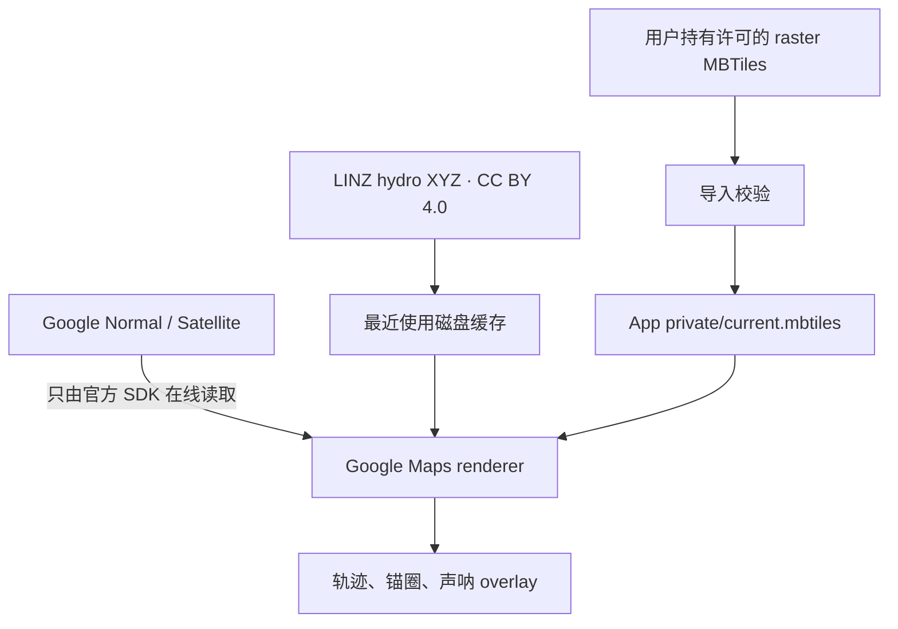

# Offline map strategy / 离线地图策略

## 中文

Yokuli 把“地图可见性”和“锚警安全计算”分开：地图服务全部不可用时，GPS、轨迹、session 和报警仍继续运行；离线地图只提供航海参考，绝不成为报警依赖。

### 当前实现

1. **Google Normal/Satellite**：不预取、不拦截、不缓存、不导出。Google 官方政策限制未授权缓存和离线使用：[Map Tiles API policies](https://developers.google.com/maps/documentation/tile/policies)。
2. **LINZ 最近使用区域**：只缓存 App 实际请求过的 LINZ hydro raster tiles。每个 chart set 上限 100 MB，LRU 清理；7 天内直接使用缓存，超过 7 天优先刷新，刷新失败则回退到旧 tile。
3. **用户导入 MBTiles**：地图图层页可导入 raster PNG/JPG/WEBP MBTiles。文件先复制到临时位置、验证 SQLite/tiles schema、zoom、图片签名和空间余量，成功后才原子替换应用私有副本。
4. **GeoPackage**：数据模型预留为后续兼容来源，但本版没有声称支持。GeoPackage 可能包含多张 raster/vector table、不同 CRS 和 style，必须先完成 table/CRS/style 选择 UI，不能把扩展名当 MBTiles 读取。

### 为什么可以缓存 LINZ，但不能因此假设所有来源都能缓存

LINZ 官方说明 LDS tile service 数据按 CC BY 4.0 提供，允许使用、复用和分享，但必须保持署名：[LDS XYZ guidance](https://www.linz.govt.nz/guidance/data-service/linz-data-service-guide/map-tile-services/using-lds-xyz-services-openlayers)、[LINZ attribution](https://www.linz.govt.nz/products-services/data/licensing-and-using-data/attributing-linz-data)。App 始终显示：

`Contains data sourced from the LINZ Data Service licensed for reuse under CC BY 4.0`

用户导入的 MBTiles 可能来自其他数据提供方。Yokuli 读取 `metadata.attribution` 并显示它，但不能替用户判断授权；导入 UI 会明确要求用户只导入有权离线保存的数据。

### MBTiles 兼容边界

- SQLite 3；必须有 `tiles(zoom_level,tile_column,tile_row,tile_data)`；
- 支持标准 TMS Y 翻转，也接受明确声明 `scheme=xyz` 的文件；
- 只支持 raster `png/jpg/jpeg/webp`，拒绝 PBF vector；
- zoom 0–24；单文件最大 4 GB；导入后至少保留 250 MB 空间；
- 数据放在 App private storage，其他 App 默认不能读取；
- 当前不解密受保护 tileset，也不执行 SQLite extension。

格式依据：[MBTiles 1.3 specification](https://github.com/mapbox/mbtiles-spec/blob/master/1.3/spec.md)。

### 存储清理

- “Clear rebuildable caches”会删除 LINZ recent tiles、LINZ depth/tide cache 和派生声呐网格，然后从原始数据重建声呐网格。
- 用户导入的 `current.mbtiles` 不会被“清缓存”删除，只能在地图图层页明确点击 Remove。
- Storage 页面分别显示数据库、离线地图、临时 cache 和剩余空间。

### 已知限制

- Google renderer 本身完全离线时可能没有底图文字/陆地样式；LINZ 或 MBTiles overlay 仍可绘制已有覆盖区。
- 最近 LINZ 缓存只包含实际浏览/跟船经过的 tile，不保证整个航区。
- 离线资料可能过期；它不替代官方海图、Notices to Mariners、测深仪或航行计划。
- 删除 App data/卸载 App 会删除私有离线地图；需要长期保存时应保留原始 MBTiles 文件。

## English

Yokuli never makes the alarm depend on map availability. Google base maps are displayed only through the official online SDK and are never prefetched or cached by Yokuli. The app may persist recently requested LINZ hydrographic raster tiles because LDS tile-service data is published for reuse under CC BY 4.0 with attribution. Each configured chart set uses a 100 MB LRU cache; tiles refresh after seven days and stale tiles remain an offline fallback if refresh fails.

Users may also import a licensed raster MBTiles archive. Imports are staged and validated before replacing the app-private file. Yokuli supports PNG/JPG/WEBP, standard TMS rows and explicitly declared XYZ rows; it rejects PBF vector tiles and malformed SQLite schemas. The 4 GB file limit and 250 MB post-import free-space reserve protect long-running safety storage.

GeoPackage is intentionally documented as a future reader, not an implemented claim. Supporting it safely requires table, CRS, raster/vector and style selection rather than treating every SQLite geospatial file as MBTiles.

Clearing rebuildable caches removes recent LINZ tiles and derived depth/grid caches, but never removes the user-imported MBTiles archive. The latter requires an explicit Remove action.
