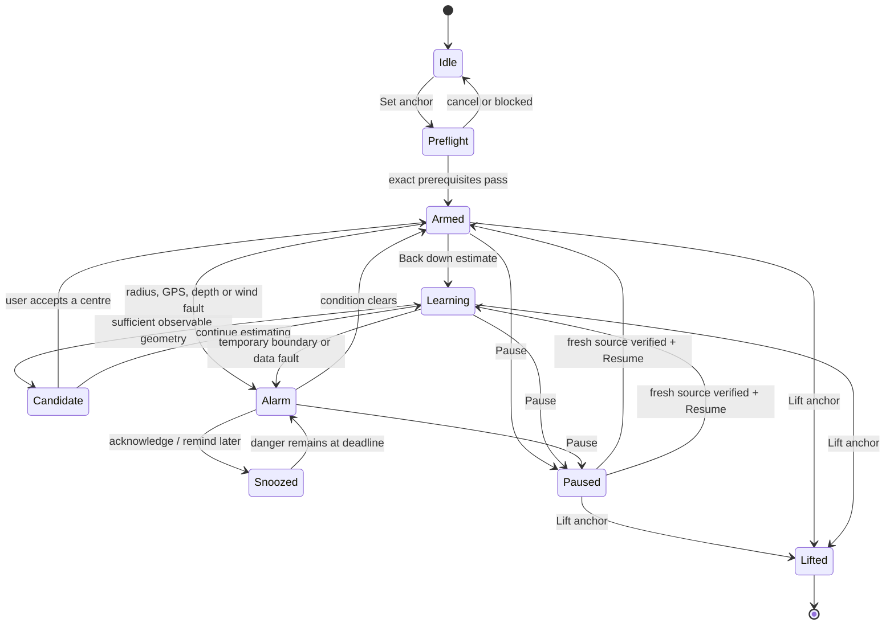
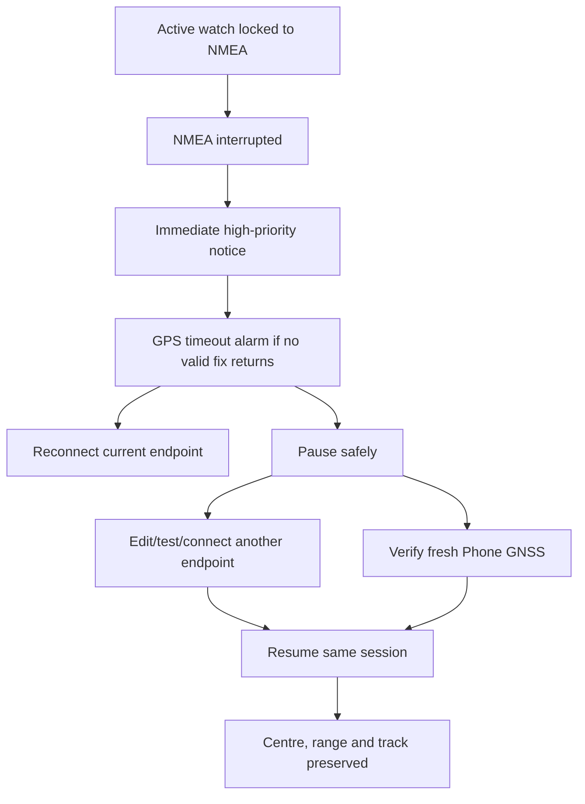

# Anchor Watch user-story safety audit / 用户故事安全审计

This document is the product-state contract for Anchor Watch. A screen is not complete merely because it contains a control: every entry must have an honest prerequisite, every running state must remain observable, and every failure must offer a safe exit or recovery path.

本文是 Anchor Watch 的产品状态契约。页面上“有按钮”不等于链路完成：每个入口必须有真实前置条件，每个运行状态必须可观察，每个失败状态必须提供安全退出或恢复方法。

## Non-negotiable invariants / 不可破坏的原则

1. An open anchor session owns its centre, range, track and selected source. Pause preserves them; Lift ends them.
   锚泊 session 拥有中心、范围、轨迹和数据源。Pause 保留，Lift 才结束。
2. Position sources never fail over silently. A source change is allowed only for a paused live session and only after the new source proves a fresh valid fix.
   定位源绝不静默切换。只有暂停中的真实 session 才能换源，而且新源必须先证明有新鲜有效定位。
3. A missing NMEA field does not erase the last observation. The value is held with its original age and becomes stale according to the consumer's own policy.
   单条 NMEA 缺字段不会抹掉历史值；值与原始时间一起保留，由各功能按自己的时效规则判断过期。
4. An environmental guard may be disabled at any time, but enabling it or changing its threshold requires fresh data from that exact instrument.
   环境警戒随时可以关闭；开启或修改阈值必须有对应仪表的实时数据。
5. Demo is an isolated session source. System and NMEA may hand over within a paused real session; Demo never joins that handover.
   演示数据源完全隔离。真实 session 暂停后可在 System/NMEA 间换源；Demo 不参与这种切换。
6. Destructive operations never pretend to succeed. Active records cannot be deleted, restore cannot run beside live runtimes, and failed writes keep the current session alive.
   破坏性操作不能假装成功。活动记录不可删除，恢复不能与实时功能并行，写入失败时当前 session 必须继续保留。

## Static end-to-end walkthrough / 静态端到端走查

This matrix is a UI/state-machine walkthrough, not an executed device test. Each row starts from a user intention, injects a realistic interruption, and checks that the user is neither silently unprotected nor trapped in an unrecoverable state.

本表是 UI 与状态机的静态走查，不是设备测试。每一行从真实使用意图出发，插入常见故障，确认用户既不会在不知情时失去保护，也不会被困在无法恢复的状态。

| Scenario / 场景 | Static decision / 静态结论 | User-visible recovery / 用户可见恢复 |
|---|---|---|
| First run → permissions → Set anchor / 首次进入到下锚 | Notification and fresh selected-position checks are hard gates in both setup and runtime; a direct service command cannot bypass them. | Failed items stay visible, Start remains a validation action, and no session/connection is mutated. |
| Connected socket but old/pre-connection/bad NMEA fix / 连接存在但船位过期、属于旧连接或质量不合格 | `CONNECTED` alone is never treated as a usable position. Setup, preflight, settings, paused handover, Resume and GPS proxy share the same freshness/current-connection/quality contract. | Wait for a new acceptable fix or choose verified Phone GNSS; no historical fix is rebound to the watch. |
| Running NMEA watch loses transport or usable fixes / NMEA 锚警运行中断线或失去可信定位 | The watch stays active and locked to NMEA, raises an immediate transition notice, then an audible GPS-loss/quality alarm after its safety timeout. | Reconnect in place, or Pause → edit/test another server or verify Phone GNSS → Resume the same session. Centre, radius and track survive. |
| Running Phone-GNSS watch loses position / 手机 GPS 锚警失去定位 | The alarm dialog no longer misroutes this failure to NMEA. | **Pause & open Phone GPS recovery** preserves the session; after precise GNSS is fresh, Resume re-arms it. |
| Environmental guard requested without its exact instrument / 没有对应仪表却开启环境警戒 | DPT/DBT, supported wind speed and true direction are checked independently in UI and service. Other NMEA sentences do not unlock them. | Existing guards and the optional deep boundary can always be explicitly disabled during an outage; enabling/changing thresholds waits for fresh evidence. |
| Enabled environment data disappears / 已开启警戒后仪表数据消失 | State becomes `DATA_UNAVAILABLE`, never `OFF` or `OK`; event, notification, audio ownership and in-app alarm remain coherent. | Snooze, restore NMEA, disable the affected guard, Pause, or Lift. Clearing one source cannot silence another alarm. |
| User disconnects NMEA while features own it / 多功能占用时主动断开 NMEA | The exact owner list is shown. A running NMEA-position watch must Pause first. Trip flush failure aborts the whole disconnect. | Explicit destructive action pauses Trip, disables guards, saves sonar and stops proxy/sharing/output before closing transport. |
| Back-down centre remains unresolved / 动态估算尚未确定中心 | A fixed temporary working boundary is authoritative; a broad possible-centre region is only visual evidence. Straight travel or local noise cannot become a resolved anchor. | Continue learning, Pause, Lift, or explicitly decide a high-confidence candidate. Alarm protection never waits for the estimator. |
| Alarm rings, then range/source/guard changes / 报警后修改范围、来源或警戒 | Alarm ownership is re-evaluated by source. A cleared radius stops; remaining danger snoozes and returns. Source changes require Pause. | Snooze, adjust range, disable an unavailable guard, Pause/recover, or Lift; none permanently acknowledges future danger. |
| Real sonar loses NMEA depth or same-stream position / 真实声呐失去水深或同源船位 | An open survey says **waiting**, not **recording**. Held depth is bounded by age and travelled distance; new points never use mobile GPS. | Reconnect the original stream or Stop/save; expiry automatically closes and saves instead of fabricating soundings. |
| Demo sonar/watch is paused or lifted / 演示声呐暂停或起锚 | Demo survey trajectory is inseparable from its Demo anchor session. | Pause shows waiting; Resume continues; Lift stops and saves the survey. Demo cannot hand over into a live source. |
| Phone-to-boat position and NMEA-position input form a loop / 手机位置写回与 NMEA 船位输入形成回环 | The two position roles are mutually exclusive in UI and runtime. Non-position depth/wind/heading can still flow. | Turn Phone Position output off before selecting NMEA Position. Disable actions always remain reachable. |
| GPS proxy process restart or source loss / GPS 代理进程重启或断源 | Android location stays normal during restore. The saved upstream gets 15 seconds to reconnect and prove a current acceptable fix before mock mode is re-entered. Repeated startup is bounded. | Failure leaves normal Android GPS active and exposes a clear retry path; every blocking STARTING/ACTIVE state has Stop. |
| Repeated bad GPS fixes overnight / 长时间连续坏定位 | Every fix still reaches safety evaluation, but durable diagnostics collapse identical failures into bounded episodes instead of growing one row per bad sentence. | A trusted recovery closes the episode; a later failure creates new evidence and alarm transitions normally. |
| Trip loses optional instruments or storage write fails / 航程缺少可选仪表或写盘失败 | Missing fields remain explicit gaps. Pause/End first flush buffered samples; write failure leaves recording alive. | Restore the instrument and continue, or retry Pause/End after storage recovery. Waypoints remain blocked without a fresh position. |
| Delete, restore, cache clear or export races live work / 删除、恢复、清缓存或导出与实时任务冲突 | DAO predicates and runtime blockers protect active history. Backup restore is one validated replacement transaction; support-log/cache maintenance has snapshot locks. | Stop/end the listed owner first. Failure reports honestly and keeps original data/session state. |
| Map/tiles/network fail during a watch / 监控中地图、瓦片或网络失败 | Map presentation is independent from the numeric/background alarm. Google tiles are not cached; user MBTiles and legal nautical fallbacks are presentation sources only. | Continue monitoring numerically, unlock/browse cached local content, or reconnect map services without touching the anchor session. |

## Anchor Watch lifecycle / 锚警生命周期

| Story / 故事 | Entry and invariant / 入口与约束 | Failure and recovery / 失败与恢复 |
|---|---|---|
| Set a known centre / 已知中心下锚 | Fresh selected GPS, notification permission and valid required fields. Manual/map coordinates stay explicit. | Invalid fields are marked; the action remains clickable so validation is visible. Existing connection/session is unchanged. |
| Back down estimate / 动态估算 | Starts a real armed session immediately. Orange temporary boundary protects the vessel while the blue possible-centre region shrinks only with observable rode-scale geometry. | Straight travel, a small local loop or GPS noise cannot resolve the centre. User may Pause, Lift or continue learning. |
| Candidate decision / 候选中心 | Applying or keeping a candidate never changes the alarm radius. Warning/alarm states block a moving centre unless the watch is paused. | Stale candidate IDs and changed centres are rejected. Confirming while paused remains paused and does not reacquire sensors. |
| Recalculate a resolved centre / 重算已确定中心 | Complete accepted history is analyzed once; no automatic centre movement. Active application requires safe/paused state and explicit confirmation. | Insufficient geometry remains comparison-only. Completed history may save an approximate anchorage reference instead of modifying an ended session. |
| Adjust range / 调整范围 | Changes only the active alarm radius; original water depth/rode/bow inputs remain session evidence and are not requested again. | If the new range clears the radius breach, sound clears. If danger remains, it snoozes and reminds later rather than becoming permanently acknowledged. |
| Pause / 暂停 | Stops alarm evaluation and releases watch/condition resources while preserving session identity, centre, candidate, track, range and configuration. | A paused session remains visibly open. It cannot be replaced by a new anchor or Demo session. |
| Resume / 继续 | Requires a new fresh valid fix from the session's current source. Condition guards wait for new post-resume instrument samples. | If no fix arrives, Resume fails and the same session remains paused. No stale coordinate is used to arm. |
| Lift anchor / 起锚 | Permanently ends the session after confirmation and silences its alarms. | Demo Lift also stops and saves an active Demo sonar survey because that survey has no independent trajectory. |

## NMEA loss and source recovery / NMEA 丢失与数据源恢复

- Auto reconnect text follows the saved profile. When it is off, the App says that manual action is required; it never claims that reconnect is running.
- The running watch is not silently switched to Phone GPS. This avoids moving the safety reference because of a source jump or an Android mock-location loop.
- A user-requested disconnect of a running NMEA-position watch first offers safe Pause. A paused session may disconnect and retain its NMEA identity for later reconnection.
- The dependency dialog lists only features that actually own the NMEA transport. A phone-only Trip or System-position sharing is not falsely listed.
- “Stop dependencies & disconnect” pauses a NMEA-owning Trip first. If its buffered write cannot commit, the operation aborts and NMEA remains connected. It then disables condition guards, saves sonar, and stops proxy/sharing/output owners before closing the transport.

- 自动重连提示严格跟随配置；关闭自动重连时，应用明确要求手动处理。
- 运行中的锚警不会偷偷切到手机 GPS，避免数据源跳变或全局 GPS 代理回环。
- 用户主动断开正在使用的 NMEA 锚警时，先提供安全暂停；暂停后可保留 NMEA 身份并等待重连。
- 依赖弹窗只列出真正占用 NMEA transport 的功能，不会把纯手机 Trip 或 System 定位共享误报为依赖。
- “停止依赖并断开”先安全暂停 Trip；若缓存写入失败，整个断开过程终止并保持连接。

## Environmental guards / 环境警戒

| Story / 故事 | Contract / 契约 |
|---|---|
| Configure before arming / 下锚前配置 | Depth needs fresh DPT/DBT. Wind speed needs a supported fresh wind observation. Wind shift needs MWD or coherent MWV-T + HDT. Unrelated NMEA traffic does not unlock a switch. |
| Configure while active / 监控中配置 | The same exact-sensor rule is enforced in both Compose and the foreground service. Existing unavailable guards and the optional deep-water boundary may always be explicitly disabled, so the user is never trapped. Commands delivered after a session has ended are rejected instead of creating an orphan monitor. |
| Data disappears / 数据消失 | The guard stays enabled, enters `DATA_UNAVAILABLE`, records an event, raises a notification and participates in global alarm audio after its grace period. It never reports `OFF` or `OK`. |
| Pause and resume / 暂停与继续 | Pause releases NMEA ownership and shows every guard as paused. Editing remembered settings does not restart it. Resume accepts only samples received after resume. |
| Wind baseline / 风向基线 | Reset is allowed only for an enabled Wind shift guard with a running watch and fresh true-direction evidence (Demo supplies its own evidence). Old evidence is not silently relabelled as new. |

## Alarm, notification and background stories / 报警、通知与后台链路

| Story / 故事 | Contract / 契约 |
|---|---|
| Real alarm / 真实报警 | Uses alarm audio attributes, vibration, high-priority notification and an in-app action dialog. The dialog cannot be dismissed without Snooze, Pause or Lift. Recovery shortcuts follow the failed source: Phone-GNSS failure never sends the user to an unrelated NMEA page. |
| Acknowledge / 确认 | Means “snooze for the configured interval”, not permanent silence. Every still-dangerous source may sound again. |
| Multiple alarms / 多警报 | Audio is owned by an arbiter. Clearing one source cannot silence another active source. |
| Range adjustment / 调范围 | Re-evaluates the current trusted fix. A cleared radius alarm stops; unchanged danger receives a fresh snooze deadline. |
| Alarm test / 警报试听 | Runs globally for at most 20 seconds, with an always-visible in-app banner containing “I can hear it” and Stop. It cannot overwrite a real safety alarm. Changing the selected sound restarts current playback with the new selection. |
| Pause/Lift / 暂停/起锚 | Both clear watch audio immediately. Pause preserves the session; Lift ends it. Condition sources are cleared separately so ownership cannot leak. |
| Process/background / 进程与后台 | Foreground-service ownership, wake/Wi-Fi locks and phone sensors are aggregated by feature. Process restore reclaims only resources required by persisted active, unpaused states. |

## Other feature stories / 其他功能链路

| Area / 模块 | Safe story / 合理链路 | Rejection or recovery / 拒绝与恢复 |
|---|---|---|
| Sonar — real / 真实声呐 | Start requires a connected NMEA stream, first valid real depth and fresh valid GPS from the same connection. Held change-only depth is age/distance labelled. | Missing depth/GPS blocks Start. An interrupted survey says **waiting**, never **recording**, offers Reconnect or Stop/save, and emits one background transition notice. Expired held evidence stops and saves after 5 minutes or 500 m. |
| Sonar — Demo / 演示声呐 | Requires a running, unpaused Demo anchor track. | Pausing Demo preserves the survey but clearly labels it waiting; Resume continues, Stop saves, and Lift stops/saves automatically. |
| Sonar layer / 声呐图层 | Viewing saved cells is offline and independent of live NMEA. Recording is a separate explicit action. | Turning on a display layer never claims that recording has started. |
| Trip Watch / 航程监控 | Mutually exclusive with Anchor Watch. Phone-only recording may adopt an already-live NMEA stream and then remembers that dependency. | Pause flushes before releasing resources; a failed flush leaves recording active. Resume restores remembered NMEA ownership. Waypoints require running state plus a fresh position. |
| Demo settings / 演示设置 | Demo locks GPS to Demo and takes a fresh System-GNSS origin for every new anchor. | Demo mode/trajectory/speed cannot change while Anchor, Trip or Sonar is open. Global NMEA GPS proxy must be off before entering Demo. |
| GPS proxy / 全局 GPS 代理 | Requires selected NMEA GPS, a fresh acceptable position from the current connection, fine-location permission and Android mock-app setup. Every state that blocks System GPS, including startup, exposes Stop. On process restore Android location stays normal while the saved upstream is reclaimed and proved. | Cold restore waits up to 15 seconds for the new connection instead of clearing a valid saved request before its first sentence. Startup itself times out safely. Stale NMEA stops injection and restores normal Android location; the terminal STALE label does not continue blocking System GPS, settings or backup. |
| Phone-to-boat output / 手机写回船网 | Requires a writable connected TCP endpoint. Non-position phone sensors can coexist with boat input. | Phone Position output and selecting NMEA Position are mutually exclusive to prevent a feedback loop. Turning outputs off is always available. |
| NMEA Sharing / NMEA 共享 | Server may share accepted System, NMEA or Demo position and filtered boat sentences. It never auto-opens a saved upstream. | If its selected output uses NMEA, the already-connected upstream remains an explicit runtime dependency. Slow clients are dropped without blocking safety producers. |
| Saved anchorage / 收藏锚地 | A resolved centre saves as confirmed. An unresolved session saves a clearly labelled estimated-region centre or temporary watch reference with uncertainty. | Nearby duplicates are rejected and open the existing record. Delete removes only the saved place, cancels a now-invalid approach target, and does not delete source history. |
| Nearby/Approach / 附近与接近指引 | One nearby area opens its complete card directly; multiple areas open a list of complete cards. Approach is only for saved anchorages. | Starting Anchor Watch cancels approach. Approach cannot start while an anchor session is open. It falls back from fresh vessel heading/course to live phone heading without changing anchor-estimator evidence. |
| QR share/import / 二维码分享与导入 | Payload is versioned, includes coordinate quality and opens Google Maps. Share image carries Anchor Watch identity. | Invalid payloads do not write data; duplicate imports open the existing anchorage path. |
| Map / 地图 | Normal, Satellite and Nautical are selected on-map. Follow lock allows gestures but returns to the vessel while preserving chosen zoom; unlock stays free. Scale and two-pin measurement are presentation-only. | Google map toolbar/navigation controls are disabled. Map loss never stops the numeric/background anchor alarm. Imported MBTiles are preferred only in Nautical and Google tiles are never cached. |
| History/reports / 历史与报告 | Anchor, Trip, event, waypoint and sonar histories remain distinct. Active rows have no destructive delete action. | DAO delete predicates also reject active rows. Exports report failure instead of deleting or mutating history. |
| Backup/restore / 备份恢复 | Export snapshots local data. Restore validates format, counts and checksums before one replacement transaction. | Restore is blocked by Anchor, Trip, Sonar, proxy, sharing, phone output or a connected live NMEA endpoint. External MBTiles/custom URI claims are reconciled rather than restored as nonexistent files. |
| Storage/support / 存储与支持 | Rebuildable caches exclude raw soundings and imported offline maps. Incident log is time/row bounded and excludes precise raw NMEA positions. | Cache clearing is blocked by active sonar and export/restore work. Incident clearing is blocked during support-bundle export so one bundle cannot contain a torn log snapshot. |
| Language/onboarding/support / 语言、欢迎与支持 | English is the default; language is always reachable from onboarding and root Settings. Donation is optional and separate from safety setup. | No support/donation step blocks first-run completion, monitoring or alarm controls. |

## Test contract / 测试契约

The following layers must remain in CI even when a local device run is intentionally skipped:

- Pure unit policies: source switching, exact condition availability, NMEA field hold/freshness, centre observability, sonar start/hold, backup restore blockers, runtime owner aggregation, approach clustering/heading, distance tools and conflict prevention.
- Database/instrumented stories: Room migrations and schemas, atomic backup replacement, high-volume streaming backup, cascade deletion, saved-anchorage duplicate/delete/re-save, MBTiles validation and QR decoding.
- Foreground-service stories: alarm audio lifecycle, Pause/Resume/Lift, NMEA loss/recovery, paused source handover, condition data loss, range change while alarming, process restore and resource ownership.
- Compose stories: every blocked control has its reason visible; alarm-test actions remain reachable; continuous Watch Health is scrollable; nearby single/multiple cards do not add duplicate detail steps.
- Long-chain stories: overnight dropout/spike/reconnect, multiple simultaneous alarm sources, sonar hold expiry, Trip buffer failure, low battery, proxy stale recovery and process restart.

Tests were added or updated with the implementation, but this audit itself is static and does not claim a test or build execution.

测试随实现一起补写；本次审计属于静态用户故事审查，不把“未运行的测试/构建”写成已通过。
